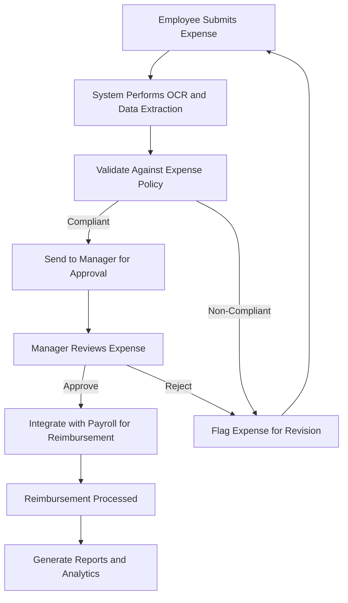
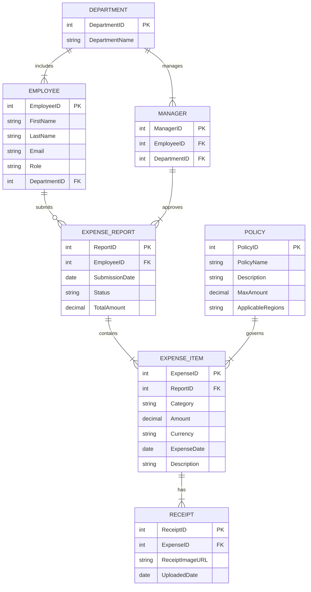
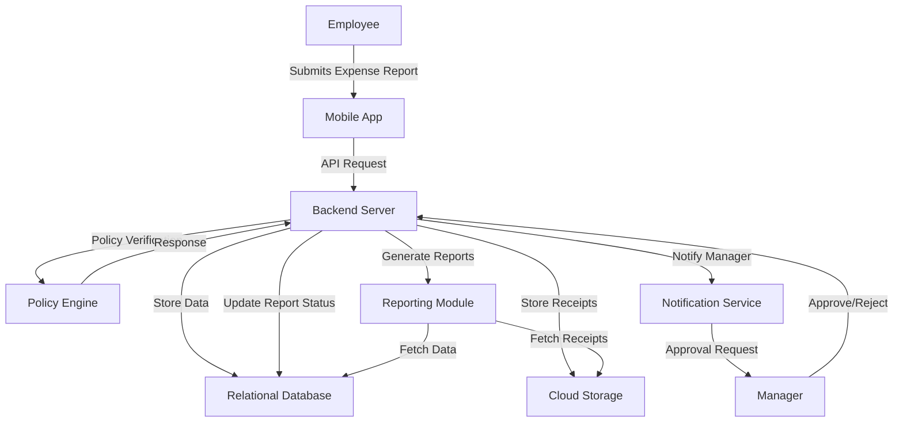

# 1. Introduction

## 1.1 Purpose

The purpose of this Software Requirements Specification (SRS) document is to provide a comprehensive description of the Global Employee Travel Expense Tracking App. It outlines the functional and non-functional requirements necessary to develop, implement, and maintain the application. This document is intended for stakeholders, including project managers, developers, testers, and business analysts, to ensure a clear and shared understanding of the system's objectives and functionalities.

## 1.2 Scope

The Global Employee Travel Expense Tracking App aims to streamline the process of submitting, approving, and managing employee travel expenses for businesses with international operations. The core functionalities include:

- **Expense Submission:** Enables employees to easily capture and submit travel expenses through a mobile application with features like OCR receipt scanning and multi-currency support.
- **Approval Workflows:** Facilitates efficient review and approval processes for managers with configurable multi-level workflows and in-app notifications.
- **Policy and Compliance Engine:** Ensures adherence to configurable expense policies and international tax laws, automatically applying relevant tax regulations and per diem rates.
- **Reimbursement Processing:** Integrates with payroll systems to automate reimbursement through various methods, ensuring timely and accurate payments.
- **Reporting and Analytics:** Provides comprehensive reporting tools and customizable dashboards for real-time visibility into travel expenses, enabling better budgeting and forecasting.
- **System Integrations:** Seamlessly integrates with existing accounting, HR, and payroll systems, as well as external tax databases and currency exchange rate providers.
- **Mobile Features:** Offers cross-platform mobile support with offline capabilities, push notifications, and a digital wallet for storing receipts and travel documents.

The application benefits organizations by reducing processing time and errors in expense management, ensuring compliance with diverse tax regulations, and improving overall efficiency in the expense reimbursement process.

## 2. Product Description

### 2.1 Product Perspective

The Global Employee Travel Expense Tracking App is designed as an integral component within an organization's existing financial and human resources ecosystem. It interfaces seamlessly with accounting software such as QuickBooks, SAP, and Oracle Financials, HR systems for employee data synchronization, and payroll systems to facilitate direct deposit reimbursements. Additionally, it connects with external tax databases and currency exchange rate providers to ensure accurate tax compliance and multi-currency support. The application leverages a cloud-based infrastructure to provide scalability and reliability, supporting multinational corporations with extensive employee bases. The mobile component of the app is built using cross-platform frameworks to ensure compatibility with both iOS and Android devices, enabling on-the-go expense management.

### 2.2 Product Functions

- **Expense Submission:** Allows employees to capture and submit travel expenses via a mobile application with OCR receipt scanning and multi-currency capabilities.
- **Approval Workflows:** Enables managers to review and approve expenses through configurable multi-level workflows with in-app notifications.
- **Policy and Compliance Engine:** Ensures expenses adhere to configurable company policies and international tax laws, automatically applying relevant tax regulations and per diem rates.
- **Reimbursement Processing:** Integrates with payroll systems to automate the reimbursement process through various payment methods.
- **Reporting and Analytics:** Provides customizable dashboards and detailed reports for real-time visibility into travel expenses, supporting budgeting and forecasting.
- **System Integrations:** Interfaces with existing accounting, HR, and payroll systems, as well as external tax databases and currency exchange rate providers.
- **Mobile Features:** Offers offline capabilities, push notifications, and a digital wallet for storing receipts and travel documents across iOS and Android platforms.

### 2.3 User Characteristics

- **Employees:**
  - **Expertise Level:** Basic to intermediate computer and mobile device proficiency.
  - **Persona:** Business travelers who need to submit expenses quickly and efficiently while on the move.
  
- **Managers:**
  - **Expertise Level:** Intermediate to advanced proficiency in financial tools and approval processes.
  - **Persona:** Supervisors responsible for reviewing and approving team members' expense reports in a timely manner.
  
- **Finance Team:**
  - **Expertise Level:** Advanced knowledge of accounting and payroll systems.
  - **Persona:** Financial analysts and accountants managing reimbursements, ensuring policy compliance, and generating financial reports.
  
- **HR Departments:**
  - **Expertise Level:** Intermediate proficiency in HR systems and employee data management.
  - **Persona:** HR professionals overseeing employee policies related to travel and expenses.
  
- **C-level Executives:**
  - **Expertise Level:** Basic understanding of expense management and financial reporting.
  - **Persona:** Executives monitoring overall travel expenses and organizational budget allocations.

### 2.4 Constraints

- **Regulatory Constraints:** Must comply with international tax laws, data privacy regulations such as GDPR and CCPA, and financial reporting standards like GAAP and IFRS.
- **Technical Constraints:** Relies on integration capabilities with existing accounting, HR, and payroll systems; must support cross-platform mobile operation on iOS and Android.
- **Budgetary Constraints:** Development and maintenance must stay within allocated budget, necessitating efficient use of resources and potential reliance on existing infrastructure.
- **Data Localization:** Must adhere to data storage and processing requirements specific to different countries, influencing cloud infrastructure choices.
- **Scalability Limits:** The cloud-based infrastructure must support scaling to accommodate multinational corporations with thousands of employees without performance degradation.

### 2.5 Assumptions and Dependencies

- **Assumptions:**
  - Organizations have existing accounting, HR, and payroll systems that support integration via APIs.
  - Employees have access to compatible mobile devices with internet connectivity for app usage.
  - Up-to-date tax databases and currency exchange rate providers are available and reliable.
  - Users will receive adequate training and support to adopt the new expense tracking system effectively.

- **Dependencies:**
  - **External Systems:** Dependence on third-party accounting, HR, and payroll systems for seamless data exchange.
  - **Tax and Currency Data Providers:** Reliance on external services for accurate tax laws and real-time currency conversion rates.
  - **Cloud Service Providers:** Dependence on cloud infrastructure providers to ensure uptime, scalability, and data security.
  - **Regulatory Bodies:** Changes in international tax laws and data protection regulations may impact system configurations and compliance features.
  - **Mobile Operating Systems:** Updates and changes in iOS and Android platforms may require app updates to maintain compatibility and functionality.

# PROCESS FLOWCHART

# FUNCTIONAL REQUIREMENTS

## 1. User Authentication and Authorization

**ID:** FR-001

**Description:** Implement secure user authentication and role-based access control to ensure that only authorized personnel can access and interact with the application's features based on their roles.

**Priority:** High

**Functional Requirements:**

| FR ID    | Description                                                          | Priority |
|----------|----------------------------------------------------------------------|----------|
| FR-001.1 | Support secure login using unique username and password             | High     |
| FR-001.2 | Implement multi-factor authentication (MFA)                        | High     |
| FR-001.3 | Enable Single Sign-On (SSO) integration with company identity providers | High   |
| FR-001.4 | Define role-based access levels for Employees, Managers, Finance Team, and Administrators | High |
| FR-001.5 | Provide password recovery and reset functionality                   | Medium   |

## 2. Expense Submission

**ID:** FR-002

**Description:** Allow employees to capture, categorize, and submit their travel expenses efficiently through a mobile application with features supporting OCR, multi-currency, and offline capabilities.

**Priority:** High

**Functional Requirements:**

| FR ID    | Description                                                          | Priority |
|----------|----------------------------------------------------------------------|----------|
| FR-002.1 | Provide a mobile interface for capturing expense details on-the-go  | High     |
| FR-002.2 | Integrate OCR technology for automatic receipt scanning and data extraction | High |
| FR-002.3 | Support multiple currencies with real-time conversion rates          | High     |
| FR-002.4 | Allow attachment of digital receipts or photos of physical receipts | High     |
| FR-002.5 | Enable categorization of expenses (e.g., meals, transportation, lodging) | High |
| FR-002.6 | Support submission of recurring expenses                             | Medium   |
| FR-002.7 | Implement mileage tracking with GPS integration                      | Medium   |
| FR-002.8 | Provide offline mode for expense entry when internet connection is unavailable | Medium |

## 3. Policy and Compliance Engine

**ID:** FR-003

**Description:** Ensure that all submitted expenses comply with configurable company policies and international tax laws by performing real-time policy checks and applying relevant regulations automatically.

**Priority:** High

**Functional Requirements:**

| FR ID    | Description                                                          | Priority |
|----------|----------------------------------------------------------------------|----------|
| FR-003.1 | Allow configuration of expense policies based on employee level, department, and travel destination | High |
| FR-003.2 | Perform real-time policy checks during expense submission            | High     |
| FR-003.3 | Integrate with global tax databases to ensure up-to-date tax compliance | High |
| FR-003.4 | Automatically apply per diem rates based on travel location          | High     |
| FR-003.5 | Flag expenses that exceed policy limits or require additional approval | High |
| FR-003.6 | Generate alerts for non-compliant expenses                          | Medium   |

## 4. Approval Workflow

**ID:** FR-004

**Description:** Facilitate efficient review and approval processes for managers through configurable multi-level workflows, batch approvals, and in-app notifications to streamline expense management.

**Priority:** High

**Functional Requirements:**

| FR ID    | Description                                                          | Priority |
|----------|----------------------------------------------------------------------|----------|
| FR-004.1 | Enable configuration of multi-level approval workflows             | High     |
| FR-004.2 | Support batch approval capabilities for managers                     | High     |
| FR-004.3 | Send in-app notifications for pending approvals                     | High     |
| FR-004.4 | Allow managers to request additional information or clarification on expenses | Medium |
| FR-004.5 | Provide delegation of approval authority during manager absences    | Medium   |
| FR-004.6 | Track approval status and history for auditing purposes             | Medium   |

## 5. Reimbursement Processing

**ID:** FR-005

**Description:** Automate the reimbursement process by integrating with payroll systems, supporting multiple payment methods, and generating necessary reports for the finance team.

**Priority:** High

**Functional Requirements:**

| FR ID    | Description                                                          | Priority |
|----------|----------------------------------------------------------------------|----------|
| FR-005.1 | Integrate with payroll systems for direct deposit reimbursements     | High     |
| FR-005.2 | Support multiple reimbursement methods (e.g., payroll, separate bank transfer) | High |
| FR-005.3 | Automatically generate expense reports for finance team review       | High     |
| FR-005.4 | Allow splitting of expenses between personal and corporate cards     | Medium   |
| FR-005.5 | Track reimbursement status and history for employees and finance team | Medium   |
| FR-005.6 | Provide notifications upon successful reimbursement processing      | Medium   |

## 6. Reporting and Analytics

**ID:** FR-006

**Description:** Provide comprehensive reporting tools and customizable dashboards to offer real-time visibility into travel expenses, supporting budgeting, forecasting, and financial analysis for various user roles.

**Priority:** High

**Functional Requirements:**

| FR ID    | Description                                                          | Priority |
|----------|----------------------------------------------------------------------|----------|
| FR-006.1 | Offer customizable dashboards tailored to different user roles       | High     |
| FR-006.2 | Generate detailed expense reports by employee, department, project, or cost center | High |
| FR-006.3 | Perform trend analysis on travel spending                           | High     |
| FR-006.4 | Enable export of reports in multiple formats (e.g., PDF, Excel, CSV) | High    |
| FR-006.5 | Create tax liability reports for different jurisdictions             | Medium   |
| FR-006.6 | Integrate with business intelligence tools for advanced analytics    | Medium   |
| FR-006.7 | Implement anomaly detection for potential fraud or policy violations | Medium  |

## 7. Tax Compliance Features

**ID:** FR-007

**Description:** Automate the identification and reporting of tax-deductible expenses, support VAT/GST reclaim processes, and ensure adherence to local tax regulations across different jurisdictions.

**Priority:** High

**Functional Requirements:**

| FR ID    | Description                                                          | Priority |
|----------|----------------------------------------------------------------------|----------|
| FR-007.1 | Automatically identify tax-deductible expenses                      | High     |
| FR-007.2 | Generate country-specific tax reports                               | High     |
| FR-007.3 | Support VAT/GST reclaim processes in applicable countries           | High     |
| FR-007.4 | Track expenses subject to withholding tax                           | Medium   |
| FR-007.5 | Allow customization of tax categories based on local regulations    | Medium   |
| FR-007.6 | Ensure compliance with changes in international tax laws            | Medium   |

## 8. Mobile Features

**ID:** FR-008

**Description:** Enhance the mobile application with features that support cross-platform usage, push notifications, offline capabilities, and secure storage of receipts and travel documents to facilitate on-the-go expense management.

**Priority:** High

**Functional Requirements:**

| FR ID    | Description                                                          | Priority |
|----------|----------------------------------------------------------------------|----------|
| FR-008.1 | Ensure cross-platform support for both iOS and Android devices      | High     |
| FR-008.2 | Implement push notifications for expense status updates and policy reminders | High |
| FR-008.3 | Provide offline mode with data synchronization when online          | High     |
| FR-008.4 | Offer a digital wallet for storing receipts and travel documents    | High     |
| FR-008.5 | Optimize mobile UI for intuitive and user-friendly experience        | Medium   |
| FR-008.6 | Ensure secure storage and encryption of sensitive data on mobile devices | Medium |
| FR-008.7 | Support camera integration for receipt scanning                      | Medium   |

## 9. System Integrations

**ID:** FR-009

**Description:** Facilitate seamless integration with existing accounting, HR, and payroll systems, as well as external tax databases and currency exchange rate providers to ensure data consistency and operational efficiency.

**Priority:** High

**Functional Requirements:**

| FR ID    | Description                                                          | Priority |
|----------|----------------------------------------------------------------------|----------|
| FR-009.1 | Integrate with accounting software such as QuickBooks, SAP, and Oracle Financials | High |
| FR-009.2 | Sync employee data with HR systems                                  | High     |
| FR-009.3 | Connect with payroll systems for reimbursement processing           | High     |
| FR-009.4 | Interface with external tax databases for up-to-date tax laws        | High     |
| FR-009.5 | Integrate with currency exchange rate providers for multi-currency support | High |
| FR-009.6 | Ensure APIs are flexible and secure for data exchange                | Medium   |
| FR-009.7 | Maintain compatibility with updates from integrated external systems | Medium   |

## 10. Data Management

**ID:** FR-010

**Description:** Ensure secure and efficient management of all data within the application, including storage, retention, export, and archiving, in compliance with legal and tax requirements.

**Priority:** High

**Functional Requirements:**

| FR ID    | Description                                                          | Priority |
|----------|----------------------------------------------------------------------|----------|
| FR-010.1 | Provide secure cloud storage for receipts and supporting documents   | High     |
| FR-010.2 | Implement data retention policies compliant with legal and tax requirements | High |
| FR-010.3 | Enable data export capabilities for auditing purposes               | High     |
| FR-010.4 | Develop an archiving system for old expense reports                   | Medium   |
| FR-010.5 | Ensure data backup and recovery processes are in place               | High     |
| FR-010.6 | Maintain data integrity and consistency across all modules           | Medium   |
| FR-010.7 | Support data anonymization for compliance with privacy regulations    | Medium  |

## 11. User Interface Requirements

**ID:** FR-011

**Description:** Design an intuitive and consistent user interface across all platforms, ensuring ease of use, accessibility, and adherence to company branding guidelines.

**Priority:** Medium

**Functional Requirements:**

| FR ID    | Description                                                          | Priority |
|----------|----------------------------------------------------------------------|----------|
| FR-011.1 | Develop a responsive web application for desktop use                 | High     |
| FR-011.2 | Create native mobile applications for iOS and Android                | High     |
| FR-011.3 | Maintain consistent branding and design language across all platforms | High     |
| FR-011.4 | Allow customization of UI elements to match company branding         | Medium   |
| FR-011.5 | Ensure the interface is intuitive and requires minimal training      | High     |
| FR-011.6 | Incorporate accessibility features compliant with WCAG 2.1 guidelines | Medium  |
| FR-011.7 | Optimize navigation and workflows for user efficiency                | Medium   |

## 12. Administration and Configuration

**ID:** FR-012

**Description:** Provide administrative tools for system configuration, user management, policy definition, workflow setup, and customization to tailor the application to organizational needs.

**Priority:** High

**Functional Requirements:**

| FR ID    | Description                                                          | Priority |
|----------|----------------------------------------------------------------------|----------|
| FR-012.1 | Develop a web-based admin portal for system configuration           | High     |
| FR-012.2 | Allow definition and updating of expense policies                    | High     |
| FR-012.3 | Enable user management and role assignment                           | High     |
| FR-012.4 | Configure approval workflows based on organizational hierarchy       | High     |
| FR-012.5 | Customize expense categories and tax rules                           | Medium   |
| FR-012.6 | Support bulk import and export of employee data                      | Medium   |
| FR-012.7 | Provide audit trails for all administrative actions                  | Medium   |

## 13. Success Metrics

**ID:** FR-013

**Description:** Define and track key performance indicators to measure the effectiveness, efficiency, and user satisfaction of the Global Employee Travel Expense Tracking App.

**Priority:** Medium

**Functional Requirements:**

| FR ID    | Description                                                          | Priority |
|----------|----------------------------------------------------------------------|----------|
| FR-013.1 | Monitor reduction in time spent on expense report submission and approval | High |
| FR-013.2 | Track increase in policy compliance rate                            | High     |
| FR-013.3 | Measure decrease in reimbursement processing time                   | Medium   |
| FR-013.4 | Assess improvement in accuracy of tax calculations and reporting    | Medium   |
| FR-013.5 | Collect user satisfaction scores for both employees and administrators | Medium |
| FR-013.6 | Analyze adoption rates and user engagement metrics                  | Medium   |
| FR-013.7 | Evaluate the impact on overall expense management efficiency        | Medium   |

## 14. Risks and Mitigation Strategies

**ID:** FR-014

**Description:** Identify potential risks associated with the development and deployment of the application and outline strategies to mitigate these risks effectively.

**Priority:** Medium

**Functional Requirements:**

| FR ID    | Description                                                          | Priority |
|----------|----------------------------------------------------------------------|----------|
| FR-014.1 | Address data privacy concerns by implementing robust security measures and obtaining relevant certifications | High |
| FR-014.2 | Mitigate complexity of international tax laws by partnering with tax experts and maintaining up-to-date tax databases | High |
| FR-014.3 | Overcome user adoption challenges by developing an intuitive UI and providing comprehensive training materials | Medium |
| FR-014.4 | Resolve integration difficulties by developing a flexible API and establishing partnerships with key software providers | Medium |
| FR-014.5 | Manage potential scalability issues by leveraging cloud infrastructure and conducting regular performance testing | Medium |
| FR-014.6 | Ensure compliance with changing regulations by implementing a monitoring system for regulatory updates | Medium   |

## 15. Integration Testing

**ID:** FR-015

**Description:** Validate the seamless integration of the Global Employee Travel Expense Tracking App with existing systems such as accounting, HR, payroll, tax databases, and currency exchange rate providers to ensure data consistency and functional interoperability.

**Priority:** High

**Functional Requirements:**

| FR ID    | Description                                                          | Priority |
|----------|----------------------------------------------------------------------|----------|
| FR-015.1 | Conduct end-to-end testing of integrations with accounting software like QuickBooks, SAP, and Oracle Financials | High |
| FR-015.2 | Validate synchronization of employee data with HR systems              | High     |
| FR-015.3 | Test connectivity and data exchange with payroll systems for reimbursements | High |
| FR-015.4 | Ensure accurate data retrieval from external tax databases            | Medium   |
| FR-015.5 | Verify real-time currency conversion rates from exchange rate providers | Medium  |
| FR-015.6 | Perform regression testing after updates to external integrated systems | Medium  |

## 16. Audit and Compliance

**ID:** FR-016

**Description:** Maintain comprehensive audit trails and ensure that all actions within the application are logged to support compliance with financial regulations and internal policies.

**Priority:** High

**Functional Requirements:**

| FR ID    | Description                                                          | Priority |
|----------|----------------------------------------------------------------------|----------|
| FR-016.1 | Implement logging of all user actions within the application        | High     |
| FR-016.2 | Provide access to detailed audit trails for financial audits        | High     |
| FR-016.3 | Ensure data integrity and prevent unauthorized data manipulation    | High     |
| FR-016.4 | Generate compliance reports as required by regulatory bodies        | Medium   |
| FR-016.5 | Maintain time-stamped records of all expense submissions and approvals | Medium |
| FR-016.6 | Facilitate periodic reviews of audit logs by the finance team       | Medium   |

## 17. Notification and Alerting System

**ID:** FR-017

**Description:** Develop a robust notification and alerting system to keep users informed about important events, updates, and actions required within the application.

**Priority:** Medium

**Functional Requirements:**

| FR ID    | Description                                                          | Priority |
|----------|----------------------------------------------------------------------|----------|
| FR-017.1 | Send email and in-app notifications for pending expense approvals   | High     |
| FR-017.2 | Notify employees of policy updates and changes                      | Medium   |
| FR-017.3 | Alert managers of newly submitted expenses awaiting approval        | High     |
| FR-017.4 | Inform users of successful reimbursements and payment completions    | Medium   |
| FR-017.5 | Provide reminders for incomplete or pending expense submissions     | Medium   |
| FR-017.6 | Allow users to configure their notification preferences             | Medium   |

## 18. Data Privacy and Security

**ID:** FR-018

**Description:** Ensure the highest standards of data privacy and security to protect sensitive financial and personal information of users and comply with relevant regulations.

**Priority:** High

**Functional Requirements:**

| FR ID    | Description                                                          | Priority |
|----------|----------------------------------------------------------------------|----------|
| FR-018.1 | Implement end-to-end encryption for all data transmissions          | High     |
| FR-018.2 | Comply with data protection regulations such as GDPR and CCPA        | High     |
| FR-018.3 | Conduct regular security audits and penetration testing             | High     |
| FR-018.4 | Securely store sensitive information like credit card numbers and bank details | High |
| FR-018.5 | Enable role-based access control to restrict data access            | High     |
| FR-018.6 | Provide mechanisms for data anonymization and pseudonymization as needed | Medium |
| FR-018.7 | Develop incident response plans for potential data breaches         | Medium   |

## 19. Performance Optimization

**ID:** FR-019

**Description:** Ensure that the application performs efficiently under various conditions, providing quick response times and handling high volumes of data and concurrent users without degradation.

**Priority:** High

**Functional Requirements:**

| FR ID    | Description                                                          | Priority |
|----------|----------------------------------------------------------------------|----------|
| FR-019.1 | Achieve app responsiveness with load times under 2 seconds           | High     |
| FR-019.2 | Support high volumes of concurrent users, especially during peak periods (e.g., month-end) | High |
| FR-019.3 | Optimize database queries and backend processes for efficiency      | High     |
| FR-019.4 | Implement caching strategies to reduce server load                   | Medium   |
| FR-019.5 | Conduct regular performance testing and optimization cycles         | Medium   |
| FR-019.6 | Scale cloud infrastructure dynamically based on user load            | High     |

## 20. Localization and Internationalization

**ID:** FR-020

**Description:** Support multiple languages and regional settings to cater to a global user base, ensuring that the application is accessible and user-friendly for employees across different countries.

**Priority:** Medium

**Functional Requirements:**

| FR ID    | Description                                                          | Priority |
|----------|----------------------------------------------------------------------|----------|
| FR-020.1 | Provide multi-language support for the user interface               | High     |
| FR-020.2 | Adapt date, time, and number formats based on regional settings      | Medium   |
| FR-020.3 | Enable localization of tax rules and compliance features            | High     |
| FR-020.4 | Allow customization of currency symbols and formats                  | High     |
| FR-020.5 | Translate all user-facing text accurately and contextually          | Medium   |
| FR-020.6 | Support right-to-left (RTL) languages where applicable              | Low      |

---

# Diagram and Tables

# 3. Non-Functional Requirements

## 3.1 Performance

**Description:**  
Define the expected performance metrics to ensure the application operates efficiently under various load conditions, providing a seamless user experience.

**Requirements:**

| Requirement ID | Description                                                                 | Priority |
|----------------|-----------------------------------------------------------------------------|----------|
| NFR-001        | The application shall have a maximum response time of 2 seconds for all user interactions. | High     |
| NFR-002        | The system shall support up to 10,000 concurrent users without performance degradation. | High     |
| NFR-003        | The mobile application shall synchronize data with the server within 5 seconds when an internet connection is available. | Medium   |
| NFR-004        | The system shall process expense submissions at a rate of 100 transactions per second during peak times. | High     |
| NFR-005        | Resource usage on the server shall not exceed 70% of CPU and 80% of memory under maximum load conditions. | High     |

## 3.2 Safety

**Description:**  
Ensure the safety of users and data in the event of system failures or unexpected issues by implementing necessary safeguards and recovery mechanisms.

**Requirements:**

| Requirement ID | Description                                                                 | Priority |
|----------------|-----------------------------------------------------------------------------|----------|
| NFR-006        | The system shall implement automatic failover mechanisms to maintain availability during server outages. | High     |
| NFR-007        | In the event of data corruption, the system shall restore the latest backup within 5 minutes to minimize data loss. | High     |
| NFR-008        | The application shall provide clear error messages and recovery guides to prevent user confusion and data mishandling during failures. | Medium   |
| NFR-009        | The mobile application shall prevent data loss by saving user inputs locally in case of sudden app termination and syncing upon recovery. | High     |

## 3.3 Security

**Description:**  
Implement robust security measures to protect user data and ensure privacy, including authentication, authorization, encryption, and compliance with data protection regulations.

**Requirements:**

| Requirement ID | Description                                                                 | Priority |
|----------------|-----------------------------------------------------------------------------|----------|
| NFR-010        | All data transmissions shall be encrypted using TLS 1.2 or higher standards. | High     |
| NFR-011        | Sensitive data at rest shall be encrypted using AES-256 encryption.         | High     |
| NFR-012        | Implement role-based access control (RBAC) to restrict access based on user roles (Employees, Managers, Finance Team, Administrators). | High     |
| NFR-013        | Support multi-factor authentication (MFA) for all user logins.              | High     |
| NFR-014        | Conduct regular security audits and penetration testing quarterly to identify and mitigate vulnerabilities. | Medium   |
| NFR-015        | Ensure compliance with GDPR, CCPA, and other relevant data privacy regulations to protect user information. | High     |

## 3.4 Quality

**Description:**  
Define quality metrics related to availability, maintainability, usability, scalability, and reliability to ensure the application meets user expectations and business requirements.

**Requirements:**

| Requirement ID | Description                                                                 | Priority |
|----------------|-----------------------------------------------------------------------------|----------|
| NFR-016        | The system shall achieve 99.9% uptime, excluding scheduled maintenance periods. | High     |
| NFR-017        | The application shall be maintainable with modular code architecture and comprehensive documentation to enable efficient updates and fixes. | High     |
| NFR-018        | The user interface shall be intuitive and require minimal training, achieving a usability score of at least 85% in user satisfaction surveys. | High     |
| NFR-019        | The system shall be easily scalable to accommodate increasing numbers of users and data volume without significant rearchitecture. | High     |
| NFR-020        | The application shall be reliable, with a mean time between failures (MTBF) of at least 1,000 hours. | High     |
| NFR-021        | Provide comprehensive logging and monitoring to facilitate quick diagnosis and resolution of issues. | Medium   |

## 3.5 Compliance

**Description:**  
Ensure the application adheres to all relevant legal, regulatory, and industry standards to avoid legal penalties and ensure operational legitimacy.

**Requirements:**

| Requirement ID | Description                                                                 | Priority |
|----------------|-----------------------------------------------------------------------------|----------|
| NFR-022        | Comply with global data protection regulations such as GDPR (Europe) and CCPA (California). | High     |
| NFR-023        | Adhere to international accounting standards like GAAP and IFRS for financial reporting. | High     |
| NFR-024        | Ensure data localization by storing data in accordance with regional laws and regulations for all supported countries. | High     |
| NFR-025        | Maintain audit trails as per financial regulations to support accountability and traceability. | High     |
| NFR-026        | Follow industry best practices for software development, including ISO/IEC 27001 for information security management. | Medium   |

---

# 4. DATA REQUIREMENTS

## 4.1 Data Models

### Entity-Relationship Diagram

### Data Entities

#### EMPLOYEE

| Attribute     | Type    | Description                          |
|---------------|---------|--------------------------------------|
| EmployeeID    | int (PK)| Unique identifier for each employee  |
| FirstName     | string  | Employee's first name                |
| LastName      | string  | Employee's last name                 |
| Email         | string  | Employee's email address             |
| Role          | string  | Role of the employee (e.g., Employee, Manager) |
| DepartmentID  | int (FK)| Reference to the department           |

#### DEPARTMENT

| Attribute       | Type    | Description                        |
|-----------------|---------|------------------------------------|
| DepartmentID    | int (PK)| Unique identifier for each department |
| DepartmentName  | string  | Name of the department             |

#### EXPENSE_REPORT

| Attribute      | Type    | Description                           |
|----------------|---------|---------------------------------------|
| ReportID       | int (PK)| Unique identifier for each expense report |
| EmployeeID     | int (FK)| Reference to the submitting employee   |
| SubmissionDate | date    | Date of report submission             |
| Status         | string  | Current status of the report (e.g., Pending, Approved, Rejected) |
| TotalAmount    | decimal | Total amount of expenses in the report |

#### EXPENSE_ITEM

| Attribute     | Type    | Description                           |
|---------------|---------|---------------------------------------|
| ExpenseID     | int (PK)| Unique identifier for each expense item |
| ReportID      | int (FK)| Reference to the associated expense report |
| Category      | string  | Category of the expense (e.g., Meals, Transportation) |
| Amount        | decimal | Amount of the expense                 |
| Currency      | string  | Currency of the expense                |
| ExpenseDate   | date    | Date when the expense was incurred     |
| Description   | string  | Description of the expense             |

#### RECEIPT

| Attribute        | Type    | Description                             |
|------------------|---------|-----------------------------------------|
| ReceiptID        | int (PK)| Unique identifier for each receipt      |
| ExpenseID        | int (FK)| Reference to the associated expense item |
| ReceiptImageURL  | string  | URL to the stored receipt image         |
| UploadedDate     | date    | Date when the receipt was uploaded      |

#### POLICY

| Attribute         | Type    | Description                             |
|-------------------|---------|-----------------------------------------|
| PolicyID          | int (PK)| Unique identifier for each policy       |
| PolicyName        | string  | Name of the policy                      |
| Description       | string  | Detailed description of the policy      |
| MaxAmount         | decimal | Maximum allowed amount for the policy   |
| ApplicableRegions | string  | Regions where the policy is applicable  |

#### MANAGER

| Attribute    | Type    | Description                            |
|--------------|---------|----------------------------------------|
| ManagerID    | int (PK)| Unique identifier for each manager     |
| EmployeeID   | int (FK)| Reference to the employee record       |
| DepartmentID | int (FK)| Reference to the managed department    |

## 4.2 Data Storage

### Data Storage Architecture

The Global Employee Travel Expense Tracking App utilizes a cloud-based storage solution to ensure scalability, redundancy, and secure data management. The primary storage components include:

- **Cloud Storage Provider:** AWS S3 is used for storing receipts and supporting documents due to its durability and scalability.
- **Relational Database:** PostgreSQL hosted on AWS RDS for managing structured data such as employee records, expense reports, and policies.
- **Backup and Recovery:** Automated daily backups with point-in-time recovery enabled. Data is replicated across multiple Availability Zones to ensure redundancy.

### Data Retention Policies

| Data Type            | Retention Period                | Description                                     |
|----------------------|---------------------------------|-------------------------------------------------|
| Expense Reports      | 7 years                         | Compliance with financial record-keeping regulations |
| Receipts             | 7 years                         | Retention for audit and tax purposes             |
| User Authentication Data | Indefinite (with periodic reviews) | Stored securely for ongoing access and compliance  |
| Logs and Audit Trails| 3 years                         | For monitoring and compliance audits              |

### Redundancy and Backup

- **Redundancy:** Data is stored with at least three copies across different geographic locations to prevent data loss.
- **Backups:** 
  - Daily automated backups are performed.
  - Weekly snapshots are taken and stored for extended retention.
  - Backup data is encrypted both in transit and at rest.
- **Recovery:** 
  - Point-in-time recovery allows restoration to any specific time within the retention window.
  - Regular disaster recovery drills are conducted to ensure data can be restored within the Recovery Time Objective (RTO) and Recovery Point Objective (RPO) defined in the SRS.

## 4.3 Data Processing

### Data Flow Diagram

### Data Security

- **Encryption:**
  - All data in transit is encrypted using TLS 1.2 or higher.
  - Sensitive data at rest in databases and storage is encrypted using AES-256.
- **Access Control:**
  - Role-based access control (RBAC) ensures that users can only access data relevant to their roles.
  - Administrative access is restricted and audited regularly.
- **Data Anonymization:**
  - Personal identifiers are anonymized where applicable to comply with privacy regulations.
- **Monitoring and Logging:**
  - All access and modification actions are logged.
  - Real-time monitoring of data access patterns to detect and respond to unauthorized access attempts.
- **Compliance:**
  - Adheres to GDPR, CCPA, and other relevant data protection regulations.
  - Implements data localization to store data within required regional boundaries.

### Data Processing Workflows

1. **Expense Submission:**
   - Employee submits an expense report via the mobile app.
   - Data is sent securely to the backend server via API.
   - Backend server processes OCR data and stores structured data in the relational database.
   - Receipts are uploaded to cloud storage with encrypted URLs stored in the database.
   - Policy engine validates expenses against company policies and tax regulations.

2. **Approval Workflow:**
   - Upon submission, an approval request is sent to the manager through the notification service.
   - Manager reviews and approves/rejects the expense report.
   - Approval status is updated in the database, and notifications are sent back to the employee.

3. **Reimbursement Processing:**
   - Approved expenses are integrated with the payroll system for reimbursement.
   - Financial data is securely exchanged with payroll systems via APIs.
   - Reimbursement status is updated and communicated to the employee.

4. **Reporting and Analytics:**
   - Reporting module aggregates data from the relational database and cloud storage.
   - Users access customizable reports and dashboards through the web interface.
   - Data exports are generated in secure formats (e.g., PDF, Excel) with access controls.

## 4.4 Data Integrity and Validation

- **Referential Integrity:**
  - Enforced through foreign key constraints in the relational database.
- **Data Validation:**
  - Input validation on both client-side and server-side to ensure data accuracy and prevent injection attacks.
- **Transactional Integrity:**
  - Use of ACID-compliant transactions in the database to maintain consistent state during data operations.
- **Error Handling:**
  - Comprehensive error detection and handling mechanisms to manage and log data processing issues.
- **Audit Trails:**
  - Detailed logs of all data creation, modification, and deletion actions to support auditing and compliance requirements.

## 4.5 Data Privacy

- **User Consent:**
  - Ensure explicit consent from users for data collection and processing activities.
- **Data Minimization:**
  - Collect only necessary data required for expense tracking and compliance.
- **Right to Access and Erasure:**
  - Provide users with the ability to access their data and request deletion as per applicable laws.
- **Third-Party Data Handling:**
  - Ensure all third-party integrations comply with data privacy standards and have appropriate data processing agreements in place.

## 4.6 Data Anonymization and Pseudonymization

- **Anonymization:**
  - Implement data anonymization techniques for reporting modules to protect personal identities while analyzing aggregate data.
- **Pseudonymization:**
  - Use pseudonyms for sensitive data fields within the database to enhance privacy without compromising data utility.

## 4.7 Data Retention and Disposal

- **Retention Schedules:**
  - Implement automated data retention schedules to manage the lifecycle of expense reports, receipts, and user data.
- **Secure Disposal:**
  - Ensure that data disposal processes comply with security standards, rendering data unrecoverable after the retention period.
- **Legal Compliance:**
  - Align data retention and disposal practices with legal and regulatory requirements for financial and personal data.

## 4.8 Data Access and Sharing

- **Internal Access:**
  - Restrict data access based on user roles and responsibilities within the organization.
- **External Sharing:**
  - Facilitate secure data sharing with authorized external systems (e.g., payroll providers) through encrypted APIs.
- **Data Export:**
  - Allow authorized users to export data for analysis and reporting purposes, ensuring exported data is encrypted and access-controlled.

## 4.9 Data Backup and Recovery

- **Regular Backups:**
  - Schedule automated backups with redundancy across multiple storage locations.
- **Recovery Procedures:**
  - Define clear procedures for data restoration in case of accidental deletions, corruption, or disasters.
- **Testing:**
  - Conduct periodic backup and recovery tests to ensure data can be restored effectively within defined timeframes.

## 4.10 Data Localization

- **Regional Storage:**
  - Store data in data centers located within the user's region to comply with local data protection laws.
- **Compliance Monitoring:**
  - Continuously monitor and update data storage locations as per evolving regional regulations.
- **Cross-Border Data Transfer:**
  - Implement secure and compliant methods for transferring data across borders when necessary, adhering to international data transfer agreements.

# EXTERNAL INTERFACES

## USER INTERFACES

The application shall provide intuitive and consistent user interfaces across all platforms to ensure ease of use and accessibility.

- **Web Interface:**
  - Accessible via modern web browsers with responsive design.
  - Placeholder for web mockup:
  
    

- **Mobile Interface:**
  - Native applications for iOS and Android platforms.
  - Intuitive navigation suitable for on-the-go usage.
  - Placeholder for mobile mockup:
  
    

- **Accessibility Features:**
  - Compliance with WCAG 2.1 guidelines.
  - Support for screen readers and keyboard navigation.

## HARDWARE INTERFACES

The application interfaces with device hardware to enhance functionality and user experience.

- **Device Camera:**
  - Utilized for capturing receipts through the OCR feature.
  - **Requirements:**
    - Access to device camera with appropriate permissions.
    - Support for capturing high-resolution images.

- **GPS Module:**
  - Used for mileage tracking in expense submissions.
  - **Requirements:**
    - Access to device GPS with user consent.
    - Accurate and real-time location tracking.

- **Storage:**
  - Utilizes device storage for offline mode capabilities.
  - **Requirements:**
    - Secure storage mechanisms to protect sensitive data.
    - Sufficient storage allocation for caching expense data.

## SOFTWARE INTERFACES

The application interacts with various external software systems to ensure seamless data exchange and operational efficiency.

- **Accounting Systems:**
  - **QuickBooks, SAP, Oracle Financials:**
    - Integration via RESTful APIs.
    - **Functionality:**
      - Synchronize expense reports and financial data.
      - Automate reimbursement processing.

- **HR Systems:**
  - **Integration:**
    - Sync employee data through existing HR APIs.
    - Ensure up-to-date employee roles and departments.

- **Payroll Systems:**
  - **Integration:**
    - Facilitate direct deposit reimbursements.
    - Exchange reimbursement data securely via APIs.

- **Tax Databases:**
  - **Integration:**
    - Access up-to-date tax laws and regulations.
    - Automate tax compliance checks during expense submission.

- **Currency Exchange Rate Providers:**
  - **Integration:**
    - Obtain real-time currency conversion rates.
    - Support multi-currency expense categorization.

- **Identity Providers:**
  - **Single Sign-On (SSO):**
    - Support SAML and OAuth protocols.
    - Enable seamless user authentication across systems.

## COMMUNICATION INTERFACES

The application employs secure and efficient communication protocols and data formats to facilitate interactions between various components and external systems.

- **Communication Protocols:**
  - **HTTPS/TLS:**
    - All data transmissions are secured using TLS 1.2 or higher.
    - Ensures data integrity and confidentiality.

  - **API Protocols:**
    - **RESTful APIs:**
      - Used for integration with external software systems.
      - Support standard HTTP methods (GET, POST, PUT, DELETE).

- **Data Formats:**
  - **JSON:**
    - Primary format for API data exchange.
    - Ensures lightweight and human-readable data transmission.

  - **XML:**
    - Support for legacy systems that require XML data formats.

- **Authentication Mechanisms:**
  - **OAuth 2.0:**
    - Secure authorization for API access.
    - Facilitates third-party integrations without exposing user credentials.

  - **API Keys and Tokens:**
    - Secure methods for authenticating API requests.
    - Manage access levels based on API key permissions.

- **Real-Time Communication:**
  - **WebSockets:**
    - Enable real-time notifications and updates within the application.
    - Support instant communication between clients and servers for approval status changes and policy updates.

# APPENDICES

## Glossary

| Term               | Definition                                                                 |
|--------------------|----------------------------------------------------------------------------|
| OCR                | Optical Character Recognition - technology used to convert different types of documents, such as scanned paper documents, PDF files, or images captured by a digital camera, into editable and searchable data. |
| API                | Application Programming Interface - a set of functions and procedures allowing the creation of applications that access features or data of an operating system, application, or other services. |
| MFA                | Multi-Factor Authentication - an authentication method that requires the user to provide two or more verification factors to gain access to a resource. |
| SSO                | Single Sign-On - an authentication scheme that allows a user to log in with a single ID to any of several related, yet independent, software systems. |
| RBAC               | Role-Based Access Control - a method of regulating access to computer or network resources based on the roles of individual users within an enterprise. |
| WCAG               | Web Content Accessibility Guidelines - a set of guidelines for improving the accessibility of web content. |
| GDPR               | General Data Protection Regulation - a regulation in EU law on data protection and privacy. |
| CCPA               | California Consumer Privacy Act - a state statute intended to enhance privacy rights and consumer protection for residents of California. |
| GAAP               | Generally Accepted Accounting Principles - a collection of commonly followed accounting rules and standards for financial reporting. |
| IFRS               | International Financial Reporting Standards - a set of accounting standards developed by the International Accounting Standards Board (IASB). |
| PRD                | Product Requirements Document - a document that outlines the specifications and requirements for a product to be developed. |
| SRS                | Software Requirements Specification - a comprehensive description of the intended purpose and environment for software under development. |
| NFR                | Non-Functional Requirements - requirements that specify criteria that can be used to judge the operation of a system, rather than specific behaviors. |

## Acronyms

| Acronym | Expanded Form                                     |
|---------|---------------------------------------------------|
| OCR     | Optical Character Recognition                     |
| API     | Application Programming Interface                 |
| MFA     | Multi-Factor Authentication                       |
| SSO     | Single Sign-On                                    |
| RBAC    | Role-Based Access Control                         |
| WCAG    | Web Content Accessibility Guidelines              |
| GDPR    | General Data Protection Regulation                |
| CCPA    | California Consumer Privacy Act                    |
| GAAP    | Generally Accepted Accounting Principles          |
| IFRS    | International Financial Reporting Standards       |
| PRD     | Product Requirements Document                     |
| SRS     | Software Requirements Specification               |
| NFR     | Non-Functional Requirements                       |

## Additional References

- **Product Requirements Document (PRD):** Detailed specifications and requirements for the Global Employee Travel Expense Tracking App.
- **Web Content Accessibility Guidelines (WCAG) 2.1:** [https://www.w3.org/TR/WCAG21/](https://www.w3.org/TR/WCAG21/)
- **General Data Protection Regulation (GDPR):** [https://gdpr.eu/](https://gdpr.eu/)
- **California Consumer Privacy Act (CCPA):** [https://oag.ca.gov/privacy/ccpa](https://oag.ca.gov/privacy/ccpa)
- **Generally Accepted Accounting Principles (GAAP):** [https://www.fasb.org/home](https://www.fasb.org/home)
- **International Financial Reporting Standards (IFRS):** [https://www.ifrs.org/](https://www.ifrs.org/)
- **ISO/IEC 27001:** Information Security Management Standards.
- **Developer Guides and API Documentation:** Provided by integrated systems such as QuickBooks, SAP, Oracle Financials, and external tax databases.
- **Cloud Service Provider Documentation:** AWS S3 and AWS RDS setup and maintenance guides.
- **User Training Materials:** Comprehensive guides and tutorials for end-users and administrators.
- **Compliance and Audit Reports:** Internal documents ensuring adherence to regulatory standards and best practices.