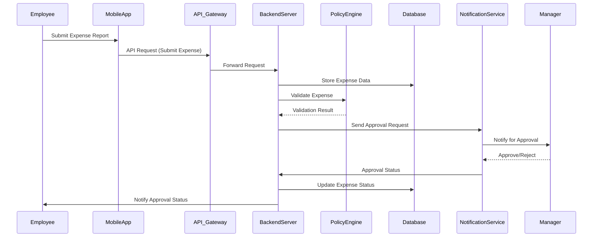
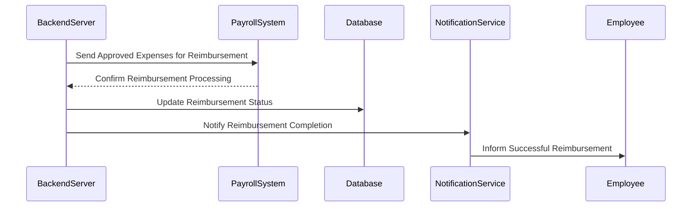
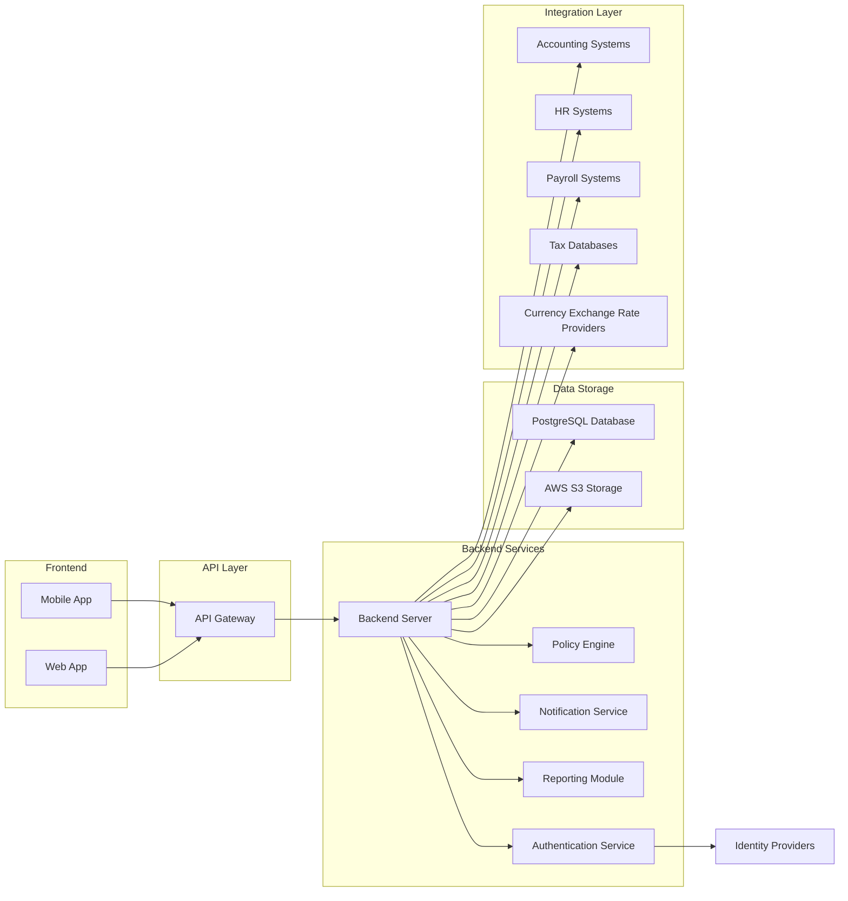
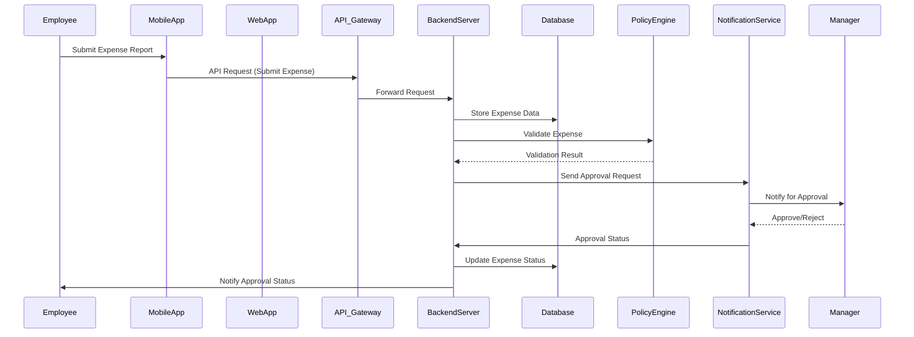
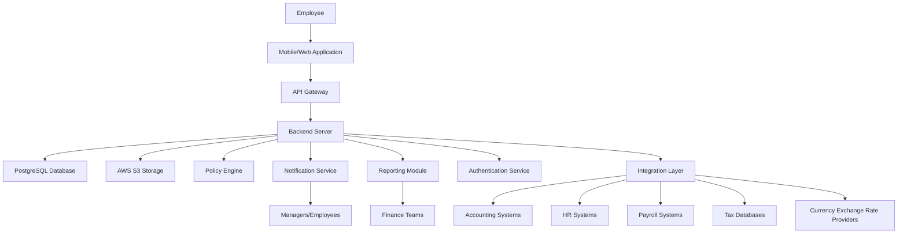
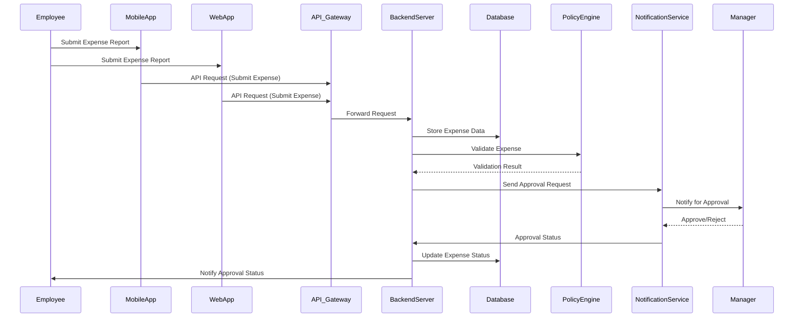
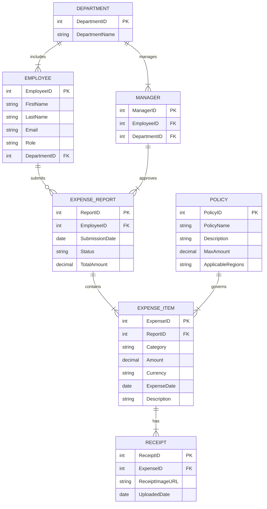

## 1. Introduction

### 1.1 System Objectives

The primary objectives of the Global Employee Travel Expense Tracking App system are:

- **Streamline Expense Management:** Automate and simplify the process of submitting, approving, and reimbursing employee travel expenses to reduce manual effort and minimize errors.
- **Ensure Compliance:** Adhere to international tax laws and company-specific expense policies, automatically applying relevant regulations and per diem rates based on employee location and travel destination.
- **Integrate Seamlessly:** Provide robust integration with existing accounting, HR, and payroll systems to ensure consistent data flow and operational efficiency across organizational tools.
- **Enhance User Experience:** Offer intuitive and user-friendly interfaces on both web and mobile platforms, facilitating easy expense submission and management for employees and managers alike.
- **Provide Comprehensive Reporting and Analytics:** Deliver real-time visibility into travel expenses through customizable dashboards and detailed reports, enabling informed decision-making for finance and executive teams.
- **Ensure Security and Scalability:** Implement robust security measures to protect sensitive financial and personal data while ensuring the system can scale to accommodate growing user bases and data volumes.
- **Improve Operational Efficiency:** Reduce processing time for expense reimbursements and enhance overall efficiency in expense management processes, contributing to better budgeting and forecasting.

### 1.2 Scope

The Global Employee Travel Expense Tracking App is designed to provide a comprehensive solution for managing employee travel expenses within organizations that operate internationally. The scope of the system includes the following key components and functionalities:

- **Expense Submission:**
  - Enable employees to capture and submit travel expenses through a mobile application with features such as OCR receipt scanning, multi-currency support, and offline data entry capabilities.
  
- **Approval Workflows:**
  - Facilitate configurable multi-level approval processes for managers, including batch approvals and in-app notifications to streamline the review and authorization of expense reports.
  
- **Policy and Compliance Engine:**
  - Implement a dynamic engine that enforces company-specific expense policies and international tax regulations, automatically applying relevant rules and flagging non-compliant expenses for further review.
  
- **Reimbursement Processing:**
  - Integrate with payroll systems to automate the reimbursement process, supporting multiple payment methods and ensuring timely and accurate payments to employees.
  
- **Reporting and Analytics:**
  - Provide customizable dashboards and detailed reporting tools for finance and executive teams, offering insights into travel spending trends, policy compliance, and overall expense management efficiency.
  
- **System Integrations:**
  - Ensure seamless connectivity with existing accounting software (e.g., QuickBooks, SAP, Oracle Financials), HR systems, payroll providers, tax databases, and currency exchange rate services to maintain data consistency and operational harmony.
  
- **Mobile Features:**
  - Deliver a robust mobile application compatible with iOS and Android devices, featuring push notifications, a digital wallet for storing receipts and documents, and secure data synchronization to support on-the-go expense management.
  
- **Security and Compliance:**
  - Adopt comprehensive security measures, including end-to-end encryption, role-based access control, and adherence to data protection regulations such as GDPR and CCPA, to safeguard sensitive information and ensure regulatory compliance.
  
- **Scalability and Reliability:**
  - Utilize a cloud-based infrastructure to support scalability for multinational corporations, ensuring high availability, redundancy, and robust disaster recovery mechanisms to maintain system reliability and uptime.
  
- **User Support and Training:**
  - Provide comprehensive training materials and support resources to facilitate user adoption, ensuring that employees, managers, and administrators can effectively utilize the system’s features and functionalities.
  
- **Localization and Internationalization:**
  - Offer multi-language support and regional settings customization to cater to a global user base, ensuring the application is accessible and user-friendly for employees across different countries and regions.

The Global Employee Travel Expense Tracking App aims to enhance the efficiency and accuracy of expense management processes, provide valuable financial insights, and ensure compliance with diverse regulatory requirements, thereby delivering significant operational benefits to organizations with international operations.

## 5. Features Breakdown

### 5.1 Feature ID: F-001

#### Description

Secure User Authentication and Role-Based Authorization ensures that users are properly authenticated and granted access rights based on their roles within the organization.

#### Priority

High

#### Technical Requirements

| Requirement ID | Description                                                                                     | Priority |
|----------------|-------------------------------------------------------------------------------------------------|----------|
| TR-F001.1      | Implement secure login using unique username and password                                       | High     |
| TR-F001.2      | Implement multi-factor authentication (MFA)                                                    | High     |
| TR-F001.3      | Enable Single Sign-On (SSO) integration with company identity providers                        | High     |
| TR-F001.4      | Define role-based access levels for Employees, Managers, Finance Team, and Administrators     | High     |
| TR-F001.5      | Provide password recovery and reset functionality                                             | Medium   |

### 5.2 Feature ID: F-002

#### Description

Expense Submission allows employees to capture, categorize, and submit travel expenses efficiently through the mobile application, incorporating OCR receipt scanning, multi-currency support, and offline capabilities.

#### Priority

High

#### Technical Requirements

| Requirement ID | Description                                                                                     | Priority |
|----------------|-------------------------------------------------------------------------------------------------|----------|
| TR-F002.1      | Provide a mobile interface for capturing expense details on-the-go                             | High     |
| TR-F002.2      | Integrate OCR technology for automatic receipt scanning and data extraction                    | High     |
| TR-F002.3      | Support multiple currencies with real-time conversion rates                                    | High     |
| TR-F002.4      | Allow attachment of digital receipts or photos of physical receipts                             | High     |
| TR-F002.5      | Enable categorization of expenses (e.g., meals, transportation, lodging)                       | High     |
| TR-F002.6      | Support submission of recurring expenses                                                        | Medium   |
| TR-F002.7      | Implement mileage tracking with GPS integration                                                | Medium   |
| TR-F002.8      | Provide offline mode for expense entry when internet connection is unavailable                  | Medium   |

### 5.3 Feature ID: F-003

#### Description

Policy and Compliance Engine ensures that all submitted expenses adhere to configurable company policies and international tax laws by performing real-time policy checks and applying relevant regulations automatically.

#### Priority

High

#### Technical Requirements

| Requirement ID | Description                                                                                     | Priority |
|----------------|-------------------------------------------------------------------------------------------------|----------|
| TR-F003.1      | Allow configuration of expense policies based on employee level, department, and travel destination | High   |
| TR-F003.2      | Perform real-time policy checks during expense submission                                      | High     |
| TR-F003.3      | Integrate with global tax databases to ensure up-to-date tax compliance                        | High     |
| TR-F003.4      | Automatically apply per diem rates based on travel location                                    | High     |
| TR-F003.5      | Flag expenses that exceed policy limits or require additional approval                         | High     |
| TR-F003.6      | Generate alerts for non-compliant expenses                                                    | Medium   |

### 5.4 Feature ID: F-004

#### Description

Approval Workflow facilitates efficient review and approval processes for managers through configurable multi-level workflows, batch approvals, and in-app notifications to streamline expense management.

#### Priority

High

#### Technical Requirements

| Requirement ID | Description                                                                                     | Priority |
|----------------|-------------------------------------------------------------------------------------------------|----------|
| TR-F004.1      | Enable configuration of multi-level approval workflows                                         | High     |
| TR-F004.2      | Support batch approval capabilities for managers                                               | High     |
| TR-F004.3      | Send in-app notifications for pending approvals                                               | High     |
| TR-F004.4      | Allow managers to request additional information or clarification on expenses                  | Medium   |
| TR-F004.5      | Provide delegation of approval authority during manager absences                                | Medium   |
| TR-F004.6      | Track approval status and history for auditing purposes                                       | Medium   |

### 5.5 Feature ID: F-005

#### Description

Reimbursement Processing automates the reimbursement process by integrating with payroll systems, supporting multiple payment methods, and generating necessary reports for the finance team.

#### Priority

High

#### Technical Requirements

| Requirement ID | Description                                                                                     | Priority |
|----------------|-------------------------------------------------------------------------------------------------|----------|
| TR-F005.1      | Integrate with payroll systems for direct deposit reimbursements                                | High     |
| TR-F005.2      | Support multiple reimbursement methods (e.g., payroll, separate bank transfer)                 | High     |
| TR-F005.3      | Automatically generate expense reports for finance team review                                 | High     |
| TR-F005.4      | Allow splitting of expenses between personal and corporate cards                                | Medium   |
| TR-F005.5      | Track reimbursement status and history for employees and finance team                           | Medium   |
| TR-F005.6      | Provide notifications upon successful reimbursement processing                                 | Medium   |

### 5.6 Feature ID: F-006

#### Description

Reporting and Analytics provides comprehensive reporting tools and customizable dashboards to offer real-time visibility into travel expenses, supporting budgeting, forecasting, and financial analysis for various user roles.

#### Priority

High

#### Technical Requirements

| Requirement ID | Description                                                                                     | Priority |
|----------------|-------------------------------------------------------------------------------------------------|----------|
| TR-F006.1      | Offer customizable dashboards tailored to different user roles                                   | High     |
| TR-F006.2      | Generate detailed expense reports by employee, department, project, or cost center                | High     |
| TR-F006.3      | Perform trend analysis on travel spending                                                       | High     |
| TR-F006.4      | Enable export of reports in multiple formats (e.g., PDF, Excel, CSV)                             | High     |
| TR-F006.5      | Create tax liability reports for different jurisdictions                                         | Medium   |
| TR-F006.6      | Integrate with business intelligence tools for advanced analytics                                | Medium   |
| TR-F006.7      | Implement anomaly detection for potential fraud or policy violations                             | Medium   |

### 5.7 Feature ID: F-007

#### Description

Tax Compliance Features automate the identification and reporting of tax-deductible expenses, support VAT/GST reclaim processes, and ensure adherence to local tax regulations across different jurisdictions.

#### Priority

High

#### Technical Requirements

| Requirement ID | Description                                                                                     | Priority |
|----------------|-------------------------------------------------------------------------------------------------|----------|
| TR-F007.1      | Automatically identify tax-deductible expenses                                                 | High     |
| TR-F007.2      | Generate country-specific tax reports                                                          | High     |
| TR-F007.3      | Support VAT/GST reclaim processes in applicable countries                                      | High     |
| TR-F007.4      | Track expenses subject to withholding tax                                                      | Medium   |
| TR-F007.5      | Allow customization of tax categories based on local regulations                               | Medium   |
| TR-F007.6      | Ensure compliance with changes in international tax laws                                       | Medium   |

### 5.8 Feature ID: F-008

#### Description

Mobile Features enhance the mobile application with support for cross-platform usage, push notifications, offline capabilities, and secure storage of receipts and travel documents to facilitate on-the-go expense management.

#### Priority

High

#### Technical Requirements

| Requirement ID | Description                                                                                     | Priority |
|----------------|-------------------------------------------------------------------------------------------------|----------|
| TR-F008.1      | Ensure cross-platform support for both iOS and Android devices                                 | High     |
| TR-F008.2      | Implement push notifications for expense status updates and policy reminders                    | High     |
| TR-F008.3      | Provide offline mode with data synchronization when online                                     | High     |
| TR-F008.4      | Offer a digital wallet for storing receipts and travel documents                               | High     |
| TR-F008.5      | Optimize mobile UI for intuitive and user-friendly experience                                  | Medium   |
| TR-F008.6      | Ensure secure storage and encryption of sensitive data on mobile devices                        | Medium   |
| TR-F008.7      | Support camera integration for receipt scanning                                                 | Medium   |

### 5.9 Feature ID: F-009

#### Description

System Integrations facilitate seamless integration with existing accounting, HR, and payroll systems, as well as external tax databases and currency exchange rate providers to ensure data consistency and operational efficiency.

#### Priority

High

#### Technical Requirements

| Requirement ID | Description                                                                                     | Priority |
|----------------|-------------------------------------------------------------------------------------------------|----------|
| TR-F009.1      | Integrate with accounting software such as QuickBooks, SAP, and Oracle Financials                | High     |
| TR-F009.2      | Sync employee data with HR systems                                                              | High     |
| TR-F009.3      | Connect with payroll systems for reimbursement processing                                       | High     |
| TR-F009.4      | Interface with external tax databases for up-to-date tax laws                                    | High     |
| TR-F009.5      | Integrate with currency exchange rate providers for multi-currency support                      | High     |
| TR-F009.6      | Ensure APIs are flexible and secure for data exchange                                            | Medium   |
| TR-F009.7      | Maintain compatibility with updates from integrated external systems                             | Medium   |

### 5.10 Feature ID: F-010

#### Description

Data Management ensures secure and efficient management of all data within the application, including storage, retention, export, and archiving, in compliance with legal and tax requirements.

#### Priority

High

#### Technical Requirements

| Requirement ID | Description                                                                                     | Priority |
|----------------|-------------------------------------------------------------------------------------------------|----------|
| TR-F010.1      | Provide secure cloud storage for receipts and supporting documents                              | High     |
| TR-F010.2      | Implement data retention policies compliant with legal and tax requirements                    | High     |
| TR-F010.3      | Enable data export capabilities for auditing purposes                                          | High     |
| TR-F010.4      | Develop an archiving system for old expense reports                                              | Medium   |
| TR-F010.5      | Ensure data backup and recovery processes are in place                                          | High     |
| TR-F010.6      | Maintain data integrity and consistency across all modules                                      | Medium   |
| TR-F010.7      | Support data anonymization for compliance with privacy regulations                               | Medium   |

### 5.11 Feature ID: F-011

#### Description

User Interface Requirements focus on designing an intuitive and consistent user interface across all platforms, ensuring ease of use, accessibility, and adherence to company branding guidelines.

#### Priority

Medium

#### Technical Requirements

| Requirement ID | Description                                                                                     | Priority |
|----------------|-------------------------------------------------------------------------------------------------|----------|
| TR-F011.1      | Develop a responsive web application for desktop use                                            | High     |
| TR-F011.2      | Create native mobile applications for iOS and Android                                           | High     |
| TR-F011.3      | Maintain consistent branding and design language across all platforms                           | High     |
| TR-F011.4      | Allow customization of UI elements to match company branding                                    | Medium   |
| TR-F011.5      | Ensure the interface is intuitive and requires minimal training                                 | High     |
| TR-F011.6      | Incorporate accessibility features compliant with WCAG 2.1 guidelines                           | Medium   |
| TR-F011.7      | Optimize navigation and workflows for user efficiency                                           | Medium   |

### 5.12 Feature ID: F-012

#### Description

Administration and Configuration provide administrative tools for system configuration, user management, policy definition, workflow setup, and customization to tailor the application to organizational needs.

#### Priority

High

#### Technical Requirements

| Requirement ID | Description                                                                                     | Priority |
|----------------|-------------------------------------------------------------------------------------------------|----------|
| TR-F012.1      | Develop a web-based admin portal for system configuration                                       | High     |
| TR-F012.2      | Allow definition and updating of expense policies                                                | High     |
| TR-F012.3      | Enable user management and role assignment                                                       | High     |
| TR-F012.4      | Configure approval workflows based on organizational hierarchy                                   | High     |
| TR-F012.5      | Customize expense categories and tax rules                                                       | Medium   |
| TR-F012.6      | Support bulk import and export of employee data                                                  | Medium   |
| TR-F012.7      | Provide audit trails for all administrative actions                                              | Medium   |

### 5.13 Feature ID: F-013

#### Description

Success Metrics define and track key performance indicators to measure the effectiveness, efficiency, and user satisfaction of the Global Employee Travel Expense Tracking App.

#### Priority

Medium

#### Technical Requirements

| Requirement ID | Description                                                                                     | Priority |
|----------------|-------------------------------------------------------------------------------------------------|----------|
| TR-F013.1      | Monitor reduction in time spent on expense report submission and approval                       | High     |
| TR-F013.2      | Track increase in policy compliance rate                                                        | High     |
| TR-F013.3      | Measure decrease in reimbursement processing time                                               | Medium   |
| TR-F013.4      | Assess improvement in accuracy of tax calculations and reporting                                | Medium   |
| TR-F013.5      | Collect user satisfaction scores for both employees and administrators                          | Medium   |
| TR-F013.6      | Analyze adoption rates and user engagement metrics                                              | Medium   |
| TR-F013.7      | Evaluate the impact on overall expense management efficiency                                    | Medium   |

### 5.14 Feature ID: F-014

#### Description

Risks and Mitigation Strategies identify potential risks associated with the development and deployment of the application and outline strategies to mitigate these risks effectively.

#### Priority

Medium

#### Technical Requirements

| Requirement ID | Description                                                                                     | Priority |
|----------------|-------------------------------------------------------------------------------------------------|----------|
| TR-F014.1      | Address data privacy concerns by implementing robust security measures and obtaining relevant certifications | High     |
| TR-F014.2      | Mitigate complexity of international tax laws by partnering with tax experts and maintaining up-to-date tax databases | High     |
| TR-F014.3      | Overcome user adoption challenges by developing an intuitive UI and providing comprehensive training materials | Medium   |
| TR-F014.4      | Resolve integration difficulties by developing a flexible API and establishing partnerships with key software providers | Medium   |
| TR-F014.5      | Manage potential scalability issues by leveraging cloud infrastructure and conducting regular performance testing | Medium   |
| TR-F014.6      | Ensure compliance with changing regulations by implementing a monitoring system for regulatory updates | Medium   |

### 5.15 Feature ID: F-015

#### Description

Integration Testing validates the seamless integration of the application with existing systems such as accounting, HR, payroll, tax databases, and currency exchange rate providers to ensure data consistency and functional interoperability.

#### Priority

High

#### Technical Requirements

| Requirement ID | Description                                                                                     | Priority |
|----------------|-------------------------------------------------------------------------------------------------|----------|
| TR-F015.1      | Conduct end-to-end testing of integrations with accounting software like QuickBooks, SAP, and Oracle Financials | High     |
| TR-F015.2      | Validate synchronization of employee data with HR systems                                       | High     |
| TR-F015.3      | Test connectivity and data exchange with payroll systems for reimbursements                     | High     |
| TR-F015.4      | Ensure accurate data retrieval from external tax databases                                       | Medium   |
| TR-F015.5      | Verify real-time currency conversion rates from exchange rate providers                           | Medium   |
| TR-F015.6      | Perform regression testing after updates to external integrated systems                          | Medium   |

### 5.16 Feature ID: F-016

#### Description

Audit and Compliance maintain comprehensive audit trails and ensure that all actions within the application are logged to support compliance with financial regulations and internal policies.

#### Priority

High

#### Technical Requirements

| Requirement ID | Description                                                                                     | Priority |
|----------------|-------------------------------------------------------------------------------------------------|----------|
| TR-F016.1      | Implement logging of all user actions within the application                                   | High     |
| TR-F016.2      | Provide access to detailed audit trails for financial audits                                   | High     |
| TR-F016.3      | Ensure data integrity and prevent unauthorized data manipulation                               | High     |
| TR-F016.4      | Generate compliance reports as required by regulatory bodies                                   | Medium   |
| TR-F016.5      | Maintain time-stamped records of all expense submissions and approvals                          | Medium   |
| TR-F016.6      | Facilitate periodic reviews of audit logs by the finance team                                  | Medium   |

### 5.17 Feature ID: F-017

#### Description

Notification and Alerting System develops a robust system to keep users informed about important events, updates, and actions required within the application through various communication channels.

#### Priority

Medium

#### Technical Requirements

| Requirement ID | Description                                                                                     | Priority |
|----------------|-------------------------------------------------------------------------------------------------|----------|
| TR-F017.1      | Send email and in-app notifications for pending expense approvals                             | High     |
| TR-F017.2      | Notify employees of policy updates and changes                                                | Medium   |
| TR-F017.3      | Alert managers of newly submitted expenses awaiting approval                                  | High     |
| TR-F017.4      | Inform users of successful reimbursements and payment completions                             | Medium   |
| TR-F017.5      | Provide reminders for incomplete or pending expense submissions                               | Medium   |
| TR-F017.6      | Allow users to configure their notification preferences                                       | Medium   |

### 5.18 Feature ID: F-018

#### Description

Data Privacy and Security ensures the highest standards of data privacy and security to protect sensitive financial and personal information of users and comply with relevant regulations.

#### Priority

High

#### Technical Requirements

| Requirement ID | Description                                                                                     | Priority |
|----------------|-------------------------------------------------------------------------------------------------|----------|
| TR-F018.1      | Implement end-to-end encryption for all data transmissions                                     | High     |
| TR-F018.2      | Comply with data protection regulations such as GDPR and CCPA                                   | High     |
| TR-F018.3      | Conduct regular security audits and penetration testing                                        | High     |
| TR-F018.4      | Securely store sensitive information like credit card numbers and bank details                  | High     |
| TR-F018.5      | Enable role-based access control to restrict data access                                       | High     |
| TR-F018.6      | Provide mechanisms for data anonymization and pseudonymization as needed                        | Medium   |
| TR-F018.7      | Develop incident response plans for potential data breaches                                     | Medium   |

### 5.19 Feature ID: F-019

#### Description

Performance Optimization ensures that the application performs efficiently under various conditions, providing quick response times and handling high volumes of data and concurrent users without degradation.

#### Priority

High

#### Technical Requirements

| Requirement ID | Description                                                                                     | Priority |
|----------------|-------------------------------------------------------------------------------------------------|----------|
| TR-F019.1      | Achieve app responsiveness with load times under 2 seconds                                      | High     |
| TR-F019.2      | Support high volumes of concurrent users, especially during peak periods (e.g., month-end)      | High     |
| TR-F019.3      | Optimize database queries and backend processes for efficiency                                 | High     |
| TR-F019.4      | Implement caching strategies to reduce server load                                              | Medium   |
| TR-F019.5      | Conduct regular performance testing and optimization cycles                                    | Medium   |
| TR-F019.6      | Scale cloud infrastructure dynamically based on user load                                       | High     |

### 5.20 Feature ID: F-020

#### Description

Localization and Internationalization support multiple languages and regional settings to cater to a global user base, ensuring that the application is accessible and user-friendly for employees across different countries.

#### Priority

Medium

#### Technical Requirements

| Requirement ID | Description                                                                                     | Priority |
|----------------|-------------------------------------------------------------------------------------------------|----------|
| TR-F020.1      | Provide multi-language support for the user interface                                          | High     |
| TR-F020.2      | Adapt date, time, and number formats based on regional settings                                 | Medium   |
| TR-F020.3      | Enable localization of tax rules and compliance features                                       | High     |
| TR-F020.4      | Allow customization of currency symbols and formats                                             | High     |
| TR-F020.5      | Translate all user-facing text accurately and contextually                                     | Medium   |
| TR-F020.6      | Support right-to-left (RTL) languages where applicable                                         | Low      |

### 5.21 Feature ID: F-021

#### Description

Data Backup and Recovery ensures that all data within the application is regularly backed up and can be restored in the event of data loss or corruption, minimizing downtime and data loss.

#### Priority

High

#### Technical Requirements

| Requirement ID | Description                                                                                     | Priority |
|----------------|-------------------------------------------------------------------------------------------------|----------|
| TR-F021.1      | Schedule automated backups with redundancy across multiple storage locations                    | High     |
| TR-F021.2      | Define clear procedures for data restoration in case of accidental deletions, corruption, or disasters | High     |
| TR-F021.3      | Conduct periodic backup and recovery tests to ensure data can be restored effectively within defined timeframes | High     |

### 5.22 Feature ID: F-022

#### Description

Data Localization ensures that data is stored in data centers located within the user's region to comply with local data protection laws, preventing unauthorized cross-border data transfers.

#### Priority

High

#### Technical Requirements

| Requirement ID | Description                                                                                     | Priority |
|----------------|-------------------------------------------------------------------------------------------------|----------|
| TR-F022.1      | Store data in data centers located within the user's region                                     | High     |
| TR-F022.2      | Continuously monitor and update data storage locations as per evolving regional regulations      | High     |
| TR-F022.3      | Implement secure and compliant methods for transferring data across borders when necessary      | High     |

### 5.23 Feature ID: F-023

#### Description

Real-Time Sync ensures that data entered through the mobile application is synchronized with the backend server promptly, maintaining data consistency and availability across platforms.

#### Priority

High

#### Technical Requirements

| Requirement ID | Description                                                                                     | Priority |
|----------------|-------------------------------------------------------------------------------------------------|----------|
| TR-F023.1      | Implement real-time data synchronization between mobile and web platforms                        | High     |
| TR-F023.2      | Ensure data consistency across all user interfaces                                               | High     |
| TR-F023.3      | Optimize synchronization processes to minimize latency                                         | Medium   |
| TR-F023.4      | Provide mechanisms for conflict resolution during data sync                                      | Medium   |

### 5.24 Feature ID: F-024

#### Description

User Training and Support provide comprehensive training materials and support resources to facilitate user adoption, ensuring that employees, managers, and administrators can effectively utilize the system’s features and functionalities.

#### Priority

Medium

#### Technical Requirements

| Requirement ID | Description                                                                                     | Priority |
|----------------|-------------------------------------------------------------------------------------------------|----------|
| TR-F024.1      | Develop comprehensive user manuals and tutorials                                               | High     |
| TR-F024.2      | Provide in-app help and tooltips to assist users                                                | Medium   |
| TR-F024.3      | Establish a support ticketing system for user assistance                                       | Medium   |
| TR-F024.4      | Conduct regular training sessions and webinars for end-users                                   | Medium   |
| TR-F024.5      | Create a knowledge base with FAQs and troubleshooting guides                                   | Low      |

### 5.25 Feature ID: F-025

#### Description

Disaster Recovery Plan outlines the strategies and procedures to recover from system failures or data loss incidents, ensuring business continuity and minimal impact on operations.

#### Priority

High

#### Technical Requirements

| Requirement ID | Description                                                                                     | Priority |
|----------------|-------------------------------------------------------------------------------------------------|----------|
| TR-F025.1      | Define Recovery Time Objective (RTO) and Recovery Point Objective (RPO)                           | High     |
| TR-F025.2      | Develop a comprehensive disaster recovery strategy                                              | High     |
| TR-F025.3      | Implement automated failover mechanisms to maintain system availability during outages           | High     |
| TR-F025.4      | Conduct regular disaster recovery drills to test and validate recovery procedures                | High     |
| TR-F025.5      | Maintain up-to-date documentation of disaster recovery processes                                 | Medium   |

### 5.26 Feature ID: F-026

#### Description

Anomaly Detection leverages advanced analytics to identify unusual patterns in expense submissions, helping to detect potential fraud or policy violations proactively.

#### Priority

Medium

#### Technical Requirements

| Requirement ID | Description                                                                                     | Priority |
|----------------|-------------------------------------------------------------------------------------------------|----------|
| TR-F026.1      | Implement machine learning algorithms to analyze expense data for anomalies                     | Medium   |
| TR-F026.2      | Define thresholds and rules for flagging unusual expense patterns                               | Medium   |
| TR-F026.3      | Integrate anomaly detection findings with the reporting module                                 | Medium   |
| TR-F026.4      | Provide alerts and notifications to administrators for flagged anomalies                        | Low      |
| TR-F026.5      | Continuously update and refine detection models based on new data and feedback                   | Low      |

---

## 6. System Architecture

### 6.1 Overview

The Global Employee Travel Expense Tracking App is designed with a scalable, secure, and modular architecture to support its comprehensive features and integrations. The architecture follows a multi-tier model, separating concerns across different layers to enhance maintainability, scalability, and security. Key components include the Mobile and Web Applications, Backend Services, Relational Database, Cloud Storage, Policy Engine, Notification Service, Reporting Module, Authentication Service, and Integration Layer. This separation ensures that each component can be developed, deployed, and scaled independently while maintaining seamless interaction between them.

### 6.2 High-Level Architecture Diagram

```mermaid
graph TD
    subgraph Frontend
        A[Mobile Application (iOS & Android)] 
        B[Web Application]
    end

    subgraph Backend
        C[API Gateway]
        D[Backend Server]
        E[Policy Engine]
        F[Notification Service]
        G[Reporting Module]
        H[Authentication Service]
    end

    subgraph Data Storage
        I[(PostgreSQL Database on AWS RDS)]
        J[(AWS S3 Storage)]
    end

    subgraph Integration
        K[Accounting Systems (QuickBooks, SAP, Oracle)]
        L[HR Systems]
        M[Payroll Systems]
        N[Tax Databases]
        O[Currency Exchange Rate Providers]
    end

    A -->|API Requests| C
    B -->|API Requests| C
    C --> D
    D --> I
    D --> J
    D --> E
    D --> F
    D --> G
    D --> H
    D --> |Integrates with| K
    D --> |Integrates with| L
    D --> |Integrates with| M
    D --> |Integrates with| N
    D --> |Integrates with| O
    H --> I
    F --> A
    F --> B
    G --> I
```

### 6.3 Component Descriptions

#### 6.3.1 Frontend

- **Mobile Application (iOS & Android):**
  - **Description:** Native mobile applications developed using cross-platform frameworks to ensure compatibility with both iOS and Android devices. Facilitates on-the-go expense submission, receipt capture, offline data entry, and real-time synchronization.
  - **Technologies:** React Native or Flutter, integrated with device APIs for camera and GPS access.

- **Web Application:**
  - **Description:** Responsive web interface accessible via modern browsers, providing users with expense submission, management, approval workflows, reporting dashboards, and administrative functions.
  - **Technologies:** React.js or Angular, ensuring a consistent and intuitive user experience.

#### 6.3.2 Backend

- **API Gateway:**
  - **Description:** Serves as the entry point for all client requests, routing them to appropriate backend services. Manages rate limiting, request validation, and API versioning.
  - **Technologies:** AWS API Gateway or Kong.

- **Backend Server:**
  - **Description:** Core business logic handling expense submissions, approvals, reimbursements, policy checks, and integrations with external systems.
  - **Technologies:** Node.js with Express, Python with Django/Flask, or Java with Spring Boot.

- **Policy Engine:**
  - **Description:** Executes real-time policy and compliance checks on submitted expenses, ensuring adherence to company policies and international tax regulations.
  - **Technologies:** Rule-based engines or microservices developed in Python or Java.

- **Notification Service:**
  - **Description:** Manages the delivery of in-app notifications, emails, and push notifications to users regarding expense statuses, approvals, and policy updates.
  - **Technologies:** AWS SNS/SQS, Firebase Cloud Messaging, or similar services.

- **Reporting Module:**
  - **Description:** Generates customizable reports and dashboards, providing real-time analytics and insights into travel expenses for finance and executive teams.
  - **Technologies:** Business intelligence tools like Tableau or custom-built solutions using D3.js.

- **Authentication Service:**
  - **Description:** Handles user authentication, authorization, Single Sign-On (SSO), and Multi-Factor Authentication (MFA) to secure access to the application.
  - **Technologies:** OAuth 2.0, OpenID Connect, integrating with identity providers like Okta or Auth0.

#### 6.3.3 Data Storage

- **PostgreSQL Database on AWS RDS:**
  - **Description:** Relational database managing structured data including user records, expense reports, policies, and transaction histories.
  - **Features:** Automated backups, replication, scalability, and high availability configurations.

- **AWS S3 Storage:**
  - **Description:** Cloud storage solution for storing receipts, supporting documents, and other unstructured data securely with high durability.
  - **Features:** Encryption at rest, lifecycle policies for data retention, and integration with CDN for fast access.

#### 6.3.4 Integration Layer

- **Accounting Systems (QuickBooks, SAP, Oracle):**
  - **Description:** Facilitates synchronization of financial data, automates reimbursement processing, and ensures seamless data flow between the expense tracking app and existing accounting software.
  - **Technologies:** RESTful APIs, Webhooks, or SDKs provided by accounting software vendors.

- **HR Systems:**
  - **Description:** Synchronizes employee data, roles, and departmental information to maintain consistency across platforms.
  - **Technologies:** API integrations with popular HR systems like Workday or ADP.

- **Payroll Systems:**
  - **Description:** Automates direct deposit reimbursements and tracks reimbursement statuses.
  - **Technologies:** Secure API connections with payroll providers.

- **Tax Databases:**
  - **Description:** Accesses up-to-date international tax laws and regulations to ensure compliance during expense processing.
  - **Technologies:** API integrations with tax data providers.

- **Currency Exchange Rate Providers:**
  - **Description:** Fetches real-time currency conversion rates to support multi-currency expense submissions.
  - **Technologies:** APIs from providers like XE or Open Exchange Rates.

#### 6.3.5 Security Components

- **Encryption Mechanisms:**
  - **Description:** Ensures all data transmissions are secured using TLS 1.2 or higher, and sensitive data at rest is encrypted using AES-256 standards.
  - **Technologies:** OpenSSL, AWS KMS for key management.

- **Access Control:**
  - **Description:** Implements Role-Based Access Control (RBAC) to restrict data and feature access based on user roles such as Employees, Managers, Finance Team, and Administrators.
  - **Technologies:** Middleware in backend services, integration with IAM solutions.

- **Compliance Monitoring:**
  - **Description:** Continuously monitors and updates compliance with GDPR, CCPA, and other relevant data protection regulations.
  - **Technologies:** Compliance management tools, custom monitoring scripts.

### 6.4 Technology Stack

| Layer              | Component                  | Technologies/Tools                                      |
|--------------------|----------------------------|---------------------------------------------------------|
| Frontend           | Mobile Application         | React Native / Flutter                                   |
|                    | Web Application            | React.js / Angular                                       |
| Backend            | API Gateway                | AWS API Gateway / Kong                                    |
|                    | Backend Server             | Node.js (Express) / Python (Django/Flask) / Java (Spring Boot) |
|                    | Policy Engine              | Python / Java, Rule-based Engine                        |
|                    | Notification Service       | AWS SNS/SQS / Firebase Cloud Messaging                   |
|                    | Reporting Module           | Tableau / D3.js                                          |
|                    | Authentication Service     | OAuth 2.0 / OpenID Connect, Okta / Auth0                  |
| Data Storage       | Relational Database        | PostgreSQL on AWS RDS                                     |
|                    | Cloud Storage              | AWS S3                                                   |
| Integration Layer  | Accounting Systems         | RESTful APIs, Webhooks                                    |
|                    | HR Systems                 | APIs from Workday / ADP                                    |
|                    | Payroll Systems            | Secure APIs from payroll providers                        |
|                    | Tax Databases              | APIs from tax data providers                              |
|                    | Currency Exchange Providers| APIs from XE / Open Exchange Rates                        |
| Security           | Encryption                 | TLS 1.2+, AES-256, OpenSSL, AWS KMS                        |
|                    | Access Control             | RBAC Middleware, IAM Solutions                            |
|                    | Compliance Monitoring      | Compliance Tools, Monitoring Scripts                     |

### 6.5 Interaction Flow

#### 6.5.1 Expense Submission

1. **Employee Action:** Submits an expense report via the Mobile or Web Application.
2. **API Gateway:** Receives the request and forwards it to the Backend Server.
3. **Backend Server:** Processes the submission, performs OCR on receipts, and stores data in PostgreSQL Database.
4. **Policy Engine:** Validates expenses against company policies and tax regulations.
5. **Notification Service:** Sends approval requests to Managers through in-app notifications and emails.



#### 6.5.2 Reimbursement Processing

1. **Backend Server:** Identifies approved expenses and integrates with Payroll Systems.
2. **Payroll Systems:** Processes reimbursements through direct deposit or other configured methods.
3. **Backend Server:** Updates reimbursement status in the Database.
4. **Notification Service:** Notifies Employees of successful reimbursements.



### 6.6 Scalability and Reliability

- **Cloud Infrastructure:**
  - **Description:** Utilizes AWS for scalable cloud services, including EC2 for compute resources, RDS for managed databases, and S3 for storage.
  - **Scalability:** Auto-scaling groups handle varying loads, ensuring the system can accommodate increasing numbers of users and data volumes without performance degradation.

- **High Availability:**
  - **Description:** Deploys services across multiple Availability Zones to ensure redundancy and minimize downtime.
  - **Disaster Recovery:** Implements automated backups and point-in-time recovery for databases, alongside regularly tested disaster recovery plans.

- **Load Balancing:**
  - **Description:** Distributes incoming traffic evenly across backend servers to optimize resource utilization and ensure consistent performance.

### 6.7 Security Measures

- **Authentication and Authorization:**
  - **MFA and SSO:** Enhances security by requiring multi-factor authentication and providing Single Sign-On capabilities.
  - **RBAC:** Ensures users have access only to the functionalities and data pertinent to their roles.

- **Data Protection:**
  - **Encryption:** All data transmissions secured with TLS 1.2+, and sensitive data encrypted at rest using AES-256.
  - **Secure Storage:** Utilizes AWS S3 with encryption and access controls for storing receipts and documents.

- **Compliance:**
  - **Regulatory Adherence:** Complies with GDPR, CCPA, and other data protection regulations through data localization and secure data handling practices.
  - **Regular Audits:** Conducts periodic security audits and penetration testing to identify and mitigate vulnerabilities.

- **Incident Response:**
  - **Plans:** Maintains incident response plans to address potential data breaches or security incidents promptly.
  - **Monitoring:** Implements real-time monitoring and alerting for unusual activities and potential security threats.

### 6.8 Technology Consistency

This architecture maintains consistency with previously outlined technology choices, leveraging AWS for cloud infrastructure, React Native or Flutter for mobile development, React.js or Angular for the web frontend, and a robust backend built with Node.js, Python, or Java. Integrations with external systems are managed through secure RESTful APIs, and compliance with security and performance standards is ensured through industry best practices and continuous monitoring.

### 6.9 Deployment Strategy

- **Continuous Integration/Continuous Deployment (CI/CD):**
  - **Description:** Implements CI/CD pipelines using tools like Jenkins, GitHub Actions, or AWS CodePipeline to automate testing, building, and deploying applications.
  - **Benefits:** Ensures rapid and reliable deployment of updates, patches, and new features with minimal downtime.

- **Containerization:**
  - **Description:** Utilizes Docker for containerizing backend services, enabling consistent environments across development, testing, and production.
  - **Orchestration:** Employs Kubernetes or AWS ECS/EKS for managing container deployments, scaling, and orchestrating microservices.

- **Monitoring and Logging:**
  - **Tools:** Uses AWS CloudWatch, ELK Stack (Elasticsearch, Logstash, Kibana), or Prometheus for comprehensive monitoring and logging.
  - **Purpose:** Enables proactive identification and resolution of performance issues, security threats, and system anomalies.

---

## 7. System Components

### 7.1 Component Diagrams

#### 7.1.1 High-Level Component Diagram

```mermaid
graph TD
    subgraph Frontend
        A[Mobile Application (iOS & Android)] 
        B[Web Application]
    end

    subgraph API Layer
        C[API Gateway]
    end

    subgraph Backend Services
        D[Backend Server]
        E[Policy Engine]
        F[Notification Service]
        G[Reporting Module]
        H[Authentication Service]
    end

    subgraph Data Storage
        I[(PostgreSQL Database on AWS RDS)]
        J[(AWS S3 Storage)]
    end

    subgraph Integration Layer
        K[Accounting Systems (QuickBooks, SAP, Oracle)]
        L[HR Systems (Workday, ADP)]
        M[Payroll Systems]
        N[Tax Databases]
        O[Currency Exchange Rate Providers]
    end

    A -->|API Requests| C
    B -->|API Requests| C
    C --> D
    D --> I
    D --> J
    D --> E
    D --> F
    D --> G
    D --> H
    D --> K
    D --> L
    D --> M
    D --> N
    D --> O
    H --> Q[Identity Providers (Okta, Auth0)]
    F -->|Notifications| A
    F -->|Notifications| B
    G --> I
```

#### 7.1.2 Detailed Component Diagram



### 7.2 Sequence Diagrams

#### 7.2.1 Expense Submission



#### 7.2.2 Reimbursement Processing


### 7.3 Data-Flow Diagram



#### Data Flow Explanation

1. **Expense Submission:**
    - **Employee** submits an expense report via **Mobile/Web Application**.
    - The application sends an **API Request** to the **API Gateway**, which routes it to the **Backend Server**.
    - **Backend Server** stores the expense data in the **PostgreSQL Database** and the attached receipts in **AWS S3 Storage**.
    - The expense data is then validated by the **Policy Engine**.

2. **Approval Workflow:**
    - Upon validation, the **Backend Server** uses the **Notification Service** to notify the **Manager**.
    - **Manager** reviews and approves/rejects the expense via **Notification Service**, which updates the **Backend Server** and **Database** accordingly.
    - **Employee** is notified of the approval status.

3. **Reimbursement Processing:**
    - Approved expenses are forwarded to the **Payroll Systems** via the **Integration Layer**.
    - **Payroll Systems** process the reimbursements and confirm back to the **Backend Server**.
    - The **Backend Server** updates the **Database** and notifies the **Employee** through the **Notification Service**.

4. **Reporting and Analytics:**
    - **Finance Teams** access reports and analytics through the **Reporting Module**, which fetches data from the **PostgreSQL Database** and **AWS S3 Storage**.

### 7.4 Component Descriptions

#### 7.4.1 Frontend Components

- **Mobile Application (iOS & Android):**
    - **Description:** Native mobile applications developed using cross-platform frameworks to ensure compatibility with both iOS and Android devices. Facilitates on-the-go expense submission, receipt capture, offline data entry, and real-time synchronization.
    - **Technologies:** React Native or Flutter.
    - **Integration:** Communicates with Backend Server via API Gateway for submitting and retrieving data.

- **Web Application:**
    - **Description:** Responsive web interface accessible via modern browsers, providing users with expense submission, management, approval workflows, reporting dashboards, and administrative functions.
    - **Technologies:** React.js or Angular.
    - **Integration:** Connects with Backend Server via API Gateway for data operations and real-time updates.

#### 7.4.2 Backend Components

- **API Gateway:**
    - **Description:** Serves as the entry point for all client requests, handling routing, rate limiting, request validation, and API versioning.
    - **Technologies:** AWS API Gateway or Kong.
    - **Responsibilities:**
        - Authenticate incoming requests.
        - Route requests to appropriate backend services.
        - Handle load balancing and throttling.

- **Backend Server:**
    - **Description:** Core business logic handling expense submissions, approvals, reimbursements, policy checks, and integrations with external systems.
    - **Technologies:** Node.js with Express, Python with Django/Flask, or Java with Spring Boot.
    - **Responsibilities:**
        - Process and validate expense data.
        - Manage business workflows for approvals and reimbursements.
        - Interface with Policy Engine, Notification Service, and Integration Layer.

- **Policy Engine:**
    - **Description:** Executes real-time policy and compliance checks on submitted expenses, ensuring adherence to company policies and international tax regulations.
    - **Technologies:** Rule-based engines or microservices developed in Python or Java.
    - **Responsibilities:**
        - Validate expenses against configurable policies.
        - Apply tax regulations and per diem rates based on travel locations.
        - Flag non-compliant expenses for further review.

- **Notification Service:**
    - **Description:** Manages the delivery of in-app notifications, emails, and push notifications to users regarding expense statuses, approvals, and policy updates.
    - **Technologies:** AWS SNS/SQS, Firebase Cloud Messaging.
    - **Responsibilities:**
        - Send approval requests to managers.
        - Notify employees of approval statuses and reimbursement completions.
        - Broadcast policy updates and reminders.

- **Reporting Module:**
    - **Description:** Generates customizable reports and dashboards, providing real-time analytics and insights into travel expenses for finance and executive teams.
    - **Technologies:** Tableau or custom-built solutions using D3.js.
    - **Responsibilities:**
        - Aggregate and visualize expense data.
        - Support export of reports in various formats.
        - Integrate with business intelligence tools for advanced analytics.

- **Authentication Service:**
    - **Description:** Handles user authentication, authorization, Single Sign-On (SSO), and Multi-Factor Authentication (MFA) to secure access to the application.
    - **Technologies:** OAuth 2.0, OpenID Connect, integrating with identity providers like Okta or Auth0.
    - **Responsibilities:**
        - Authenticate users via SSO and MFA.
        - Manage user sessions and tokens.
        - Enforce role-based access control.

#### 7.4.3 Data Storage Components

- **PostgreSQL Database on AWS RDS:**
    - **Description:** Relational database managing structured data including user records, expense reports, policies, and transaction histories.
    - **Features:** Automated backups, replication, scalability, and high availability configurations.
    - **Responsibilities:**
        - Store and manage transactional data.
        - Ensure data integrity and consistency.
        - Support complex queries for reporting and analytics.

- **AWS S3 Storage:**
    - **Description:** Cloud storage solution for storing receipts, supporting documents, and other unstructured data securely with high durability.
    - **Features:** Encryption at rest, lifecycle policies for data retention, and integration with CDN for fast access.
    - **Responsibilities:**
        - Store and retrieve receipt images and supporting documents.
        - Manage storage lifecycle and archival.
        - Ensure secure access and data encryption.

#### 7.4.4 Integration Layer Components

- **Accounting Systems (QuickBooks, SAP, Oracle Financials):**
    - **Description:** Facilitates synchronization of financial data, automates reimbursement processing, and ensures seamless data flow between the expense tracking app and existing accounting software.
    - **Technologies:** RESTful APIs, Webhooks, or SDKs provided by accounting software vendors.
    - **Responsibilities:**
        - Sync expense data with accounting ledgers.
        - Automate reimbursement entries.
        - Maintain data consistency across systems.

- **HR Systems (Workday, ADP):**
    - **Description:** Synchronizes employee data, roles, and departmental information to maintain consistency across platforms.
    - **Technologies:** API integrations with popular HR systems.
    - **Responsibilities:**
        - Update employee profiles and roles.
        - Manage departmental data and hierarchy.
        - Ensure real-time data synchronization.

- **Payroll Systems:**
    - **Description:** Automates direct deposit reimbursements and tracks reimbursement statuses.
    - **Technologies:** Secure API connections with payroll providers.
    - **Responsibilities:**
        - Process reimbursement payments.
        - Update reimbursement statuses.
        - Handle multiple payment methods.

- **Tax Databases:**
    - **Description:** Accesses up-to-date international tax laws and regulations to ensure compliance during expense processing.
    - **Technologies:** API integrations with tax data providers.
    - **Responsibilities:**
        - Provide real-time tax rate information.
        - Update tax rules based on regulatory changes.
        - Support tax compliance checks.

- **Currency Exchange Rate Providers (XE, Open Exchange Rates):**
    - **Description:** Fetches real-time currency conversion rates to support multi-currency expense submissions.
    - **Technologies:** APIs from providers.
    - **Responsibilities:**
        - Provide accurate and up-to-date exchange rates.
        - Support multi-currency calculations and conversions.
        - Integrate exchange rates into expense submissions.

#### 7.4.5 Security Components

- **Encryption Mechanisms:**
    - **Description:** Ensures all data transmissions are secured using TLS 1.2 or higher, and sensitive data at rest is encrypted using AES-256.
    - **Technologies:** OpenSSL, AWS KMS for key management.
    - **Responsibilities:**
        - Encrypt data in transit and at rest.
        - Manage encryption keys securely.
        - Ensure compliance with encryption standards.

- **Access Control:**
    - **Description:** Implements Role-Based Access Control (RBAC) to restrict data and feature access based on user roles such as Employees, Managers, Finance Team, and Administrators.
    - **Technologies:** Middleware in backend services, integration with IAM solutions.
    - **Responsibilities:**
        - Define and enforce access policies.
        - Manage user roles and permissions.
        - Audit access control changes.

- **Compliance Monitoring:**
    - **Description:** Continuously monitors and updates compliance with GDPR, CCPA, and other relevant data protection regulations.
    - **Technologies:** Compliance management tools, custom monitoring scripts.
    - **Responsibilities:**
        - Track regulatory changes.
        - Update system configurations for compliance.
        - Generate compliance reports.

### 7.5 Technology Stack

| Layer              | Component                  | Technologies/Tools                                      |
|--------------------|----------------------------|---------------------------------------------------------|
| Frontend           | Mobile Application         | React Native / Flutter                                   |
|                    | Web Application            | React.js / Angular                                       |
| API Layer          | API Gateway                | AWS API Gateway / Kong                                    |
| Backend            | Backend Server             | Node.js (Express) / Python (Django/Flask) / Java (Spring Boot) |
|                    | Policy Engine              | Python / Java, Rule-based Engine                        |
|                    | Notification Service       | AWS SNS/SQS / Firebase Cloud Messaging                   |
|                    | Reporting Module           | Tableau / D3.js                                          |
|                    | Authentication Service     | OAuth 2.0 / OpenID Connect, Okta / Auth0                  |
| Data Storage       | Relational Database        | PostgreSQL on AWS RDS                                     |
|                    | Cloud Storage              | AWS S3                                                   |
| Integration Layer  | Accounting Systems         | RESTful APIs, Webhooks                                    |
|                    | HR Systems                 | APIs from Workday / ADP                                    |
|                    | Payroll Systems            | Secure APIs from payroll providers                        |
|                    | Tax Databases              | APIs from tax data providers                              |
|                    | Currency Exchange Providers| APIs from XE / Open Exchange Rates                        |
| Security           | Encryption                 | TLS 1.2+, AES-256, OpenSSL, AWS KMS                        |
|                    | Access Control             | RBAC Middleware, IAM Solutions                            |
|                    | Compliance Monitoring      | Compliance Tools, Monitoring Scripts                     |

### 7.6 Interaction Flow

#### 7.6.1 Expense Submission

1. **Employee Action:** Submits an expense report via the Mobile or Web Application.
2. **API Gateway:** Receives the request and forwards it to the Backend Server.
3. **Backend Server:** Processes the submission, performs OCR on receipts, and stores data in the PostgreSQL Database.
4. **Policy Engine:** Validates expenses against company policies and tax regulations.
5. **Notification Service:** Sends approval requests to Managers through in-app notifications and emails.



#### 7.6.2 Reimbursement Processing

1. **Backend Server:** Identifies approved expenses and integrates with Payroll Systems.
2. **Payroll Systems:** Processes reimbursements through direct deposit or other configured methods.
3. **Backend Server:** Updates reimbursement status in the Database.
4. **Notification Service:** Notifies Employees of successful reimbursements.


### 7.7 Security Measures

- **Authentication and Authorization:**
    - **MFA and SSO:** Enhances security by requiring multi-factor authentication and providing Single Sign-On capabilities.
    - **RBAC:** Ensures users have access only to the functionalities and data pertinent to their roles.

- **Data Protection:**
    - **Encryption:** All data transmissions secured with TLS 1.2+, and sensitive data encrypted at rest using AES-256.
    - **Secure Storage:** Utilizes AWS S3 with encryption and access controls for storing receipts and documents.

- **Compliance:**
    - **Regulatory Adherence:** Complies with GDPR, CCPA, and other data protection regulations through data localization and secure data handling practices.
    - **Regular Audits:** Conducts periodic security audits and penetration testing to identify and mitigate vulnerabilities.

- **Incident Response:**
    - **Plans:** Maintains incident response plans to address potential data breaches or security incidents promptly.
    - **Monitoring:** Implements real-time monitoring and alerting for unusual activities and potential security threats.

### 7.8 Technology Consistency

This architecture maintains consistency with previously outlined technology choices, leveraging AWS for cloud infrastructure, React Native or Flutter for mobile development, React.js or Angular for the web frontend, and a robust backend built with Node.js, Python, or Java. Integrations with external systems are managed through secure RESTful APIs, and compliance with security and performance standards is ensured through industry best practices and continuous monitoring.

### 7.9 Deployment Strategy

- **Continuous Integration/Continuous Deployment (CI/CD):**
    - **Description:** Implements CI/CD pipelines using tools like Jenkins, GitHub Actions, or AWS CodePipeline to automate testing, building, and deploying applications.
    - **Benefits:** Ensures rapid and reliable deployment of updates, patches, and new features with minimal downtime.

- **Containerization:**
    - **Description:** Utilizes Docker for containerizing backend services, enabling consistent environments across development, testing, and production.
    - **Orchestration:** Employs Kubernetes or AWS ECS/EKS for managing container deployments, scaling, and orchestrating microservices.

- **Monitoring and Logging:**
    - **Tools:** Uses AWS CloudWatch, ELK Stack (Elasticsearch, Logstash, Kibana), or Prometheus for comprehensive monitoring and logging.
    - **Purpose:** Enables proactive identification and resolution of performance issues, security threats, and system anomalies.

---

## 8. System Design

### 8.1 Programming Languages

| Component             | Programming Language         | Justification                                                                                                                                             |
|-----------------------|-------------------------------|-----------------------------------------------------------------------------------------------------------------------------------------------------------|
| **Mobile Application**| React Native / Flutter        | Enables cross-platform development for both iOS and Android, reducing development time and ensuring a consistent user experience across devices.            |
| **Web Application**   | React.js / Angular            | Provides a robust framework for building responsive and dynamic user interfaces with high performance and scalability.                                      |
| **Backend Server**    | Node.js (Express) / Python (Django/Flask) / Java (Spring Boot) | **Node.js:** Ideal for asynchronous, event-driven applications.<br>**Python:** Facilitates rapid development and ease of integration.<br>**Java:** Ensures scalability and reliability for enterprise-level operations. |
| **Policy Engine**     | Python / Java                 | **Python:** Simplifies rule-based logic implementation.<br>**Java:** Offers performance and scalability for handling complex policy checks.                   |
| **Authentication Service** | Node.js / Python / Java     | Supports OAuth 2.0 and OpenID Connect protocols, integrating seamlessly with backend technologies and ensuring secure authentication mechanisms.              |
| **Reporting Module**  | JavaScript (D3.js) / Python   | **D3.js:** Enables dynamic and interactive data visualizations.<br>**Python:** Facilitates data processing and integration with business intelligence tools.  |

### 8.2 Database Design

#### Entity-Relationship Diagram



#### Data Entities

##### EMPLOYEE

| Attribute    | Type     | Description                         |
|--------------|----------|-------------------------------------|
| EmployeeID   | int (PK) | Unique identifier for each employee |
| FirstName    | string   | Employee's first name               |
| LastName     | string   | Employee's last name                |
| Email        | string   | Employee's email address            |
| Role         | string   | Role of the employee (e.g., Employee, Manager) |
| DepartmentID | int (FK) | Reference to the department         |

##### DEPARTMENT

| Attribute       | Type     | Description                        |
|-----------------|----------|------------------------------------|
| DepartmentID    | int (PK) | Unique identifier for each department |
| DepartmentName  | string   | Name of the department             |

##### EXPENSE_REPORT

| Attribute      | Type     | Description                                      |
|----------------|----------|--------------------------------------------------|
| ReportID       | int (PK) | Unique identifier for each expense report        |
| EmployeeID     | int (FK) | Reference to the submitting employee             |
| SubmissionDate | date     | Date of report submission                        |
| Status         | string   | Current status of the report (e.g., Pending, Approved, Rejected) |
| TotalAmount    | decimal  | Total amount of expenses in the report           |

##### EXPENSE_ITEM

| Attribute    | Type     | Description                                         |
|--------------|----------|-----------------------------------------------------|
| ExpenseID    | int (PK) | Unique identifier for each expense item             |
| ReportID     | int (FK) | Reference to the associated expense report          |
| Category     | string   | Category of the expense (e.g., Meals, Transportation) |
| Amount       | decimal  | Amount of the expense                               |
| Currency     | string   | Currency of the expense                             |
| ExpenseDate  | date     | Date when the expense was incurred                  |
| Description  | string   | Description of the expense                          |

##### RECEIPT

| Attribute        | Type     | Description                          |
|------------------|----------|--------------------------------------|
| ReceiptID        | int (PK) | Unique identifier for each receipt   |
| ExpenseID        | int (FK) | Reference to the associated expense item |
| ReceiptImageURL  | string   | URL to the stored receipt image       |
| UploadedDate     | date     | Date when the receipt was uploaded    |

##### POLICY

| Attribute         | Type     | Description                                      |
|-------------------|----------|--------------------------------------------------|
| PolicyID          | int (PK) | Unique identifier for each policy                |
| PolicyName        | string   | Name of the policy                               |
| Description       | string   | Detailed description of the policy               |
| MaxAmount         | decimal  | Maximum allowed amount for the policy            |
| ApplicableRegions | string   | Regions where the policy is applicable           |

##### MANAGER

| Attribute    | Type     | Description                         |
|--------------|----------|-------------------------------------|
| ManagerID    | int (PK) | Unique identifier for each manager  |
| EmployeeID   | int (FK) | Reference to the employee record    |
| DepartmentID | int (FK) | Reference to the managed department |

### 8.3 API Design

#### Overview

The Global Employee Travel Expense Tracking App utilizes RESTful APIs for communication between the frontend, backend, and external systems. All APIs are versioned to ensure backward compatibility and are secured using OAuth 2.0 and OpenID Connect protocols.

#### API Standards

- **Base URL:** `https://api.expensetracker.com/v1/`
- **Authentication:** OAuth 2.0 Bearer Tokens
- **Data Format:** JSON for request and response bodies
- **Error Handling:** Standard HTTP status codes and error messages in JSON format

#### Key API Endpoints

##### 1. User Authentication

| Endpoint               | Method | Description                        |
|------------------------|--------|------------------------------------|
| `/auth/login`          | POST   | Authenticate user and issue token  |
| `/auth/logout`         | POST   | Revoke user token                  |
| `/auth/refresh`        | POST   | Refresh authentication token       |

##### 2. Expense Reports

| Endpoint                      | Method | Description                              |
|-------------------------------|--------|------------------------------------------|
| `/expenses`                   | GET    | Retrieve list of expense reports         |
| `/expenses`                   | POST   | Submit a new expense report              |
| `/expenses/{reportId}`        | GET    | Retrieve details of a specific expense report |
| `/expenses/{reportId}`        | PUT    | Update a specific expense report         |
| `/expenses/{reportId}`        | DELETE | Delete a specific expense report         |

##### 3. Expense Items

| Endpoint                      | Method | Description                              |
|-------------------------------|--------|------------------------------------------|
| `/expenses/{reportId}/items`  | GET    | Retrieve list of expense items for a report |
| `/expenses/{reportId}/items`  | POST   | Add a new expense item to a report       |
| `/expenses/{reportId}/items/{itemId}` | GET    | Retrieve details of a specific expense item |
| `/expenses/{reportId}/items/{itemId}` | PUT    | Update a specific expense item           |
| `/expenses/{reportId}/items/{itemId}` | DELETE | Delete a specific expense item           |

##### 4. Receipts

| Endpoint                      | Method | Description                              |
|-------------------------------|--------|------------------------------------------|
| `/expenses/{reportId}/items/{itemId}/receipts` | POST   | Upload a receipt image                   |
| `/receipts/{receiptId}`       | GET    | Retrieve a receipt image URL             |
| `/receipts/{receiptId}`       | DELETE | Delete a specific receipt                |

##### 5. Managers and Approvals

| Endpoint                      | Method | Description                              |
|-------------------------------|--------|------------------------------------------|
| `/managers/{managerId}/approvals` | GET    | Retrieve pending approvals for a manager |
| `/approvals/{approvalId}`     | POST   | Approve or reject an expense report      |

##### 6. Reporting and Analytics

| Endpoint                      | Method | Description                              |
|-------------------------------|--------|------------------------------------------|
| `/reports/expenses`           | GET    | Generate expense reports                 |
| `/reports/analytics`          | GET    | Retrieve analytics data                  |

##### 7. Integration with External Systems

| Endpoint                      | Method | Description                              |
|-------------------------------|--------|------------------------------------------|
| `/integrations/payroll`       | POST   | Send approved expenses to payroll systems |
| `/integrations/tax`           | GET    | Retrieve latest tax regulations          |
| `/integrations/exchange-rates`| GET    | Fetch real-time currency exchange rates  |
| `/integrations/accounting`    | POST   | Sync expense data with accounting systems|

#### API Security

- **OAuth 2.0:** All endpoints require a valid Bearer Token obtained through the authentication process.
- **Rate Limiting:** Implemented at the API Gateway to prevent abuse and ensure service availability.
- **Input Validation:** All input data is validated on the server side to prevent injection attacks and ensure data integrity.
- **HTTPS Enforcement:** All API requests must be made over HTTPS to secure data in transit.

#### API Versioning

- **Strategy:** URI versioning is used to manage different API versions.
- **Example:** `/v1/expenses` for version 1 of the expenses API.
- **Deprecation Policy:** Older versions will be deprecated after two major releases, with a notice period of six months for clients to migrate to newer versions.

### 8.4 Technology Stack Alignment

| Layer              | Component                  | Programming Language | Justification                                                                                                 |
|--------------------|----------------------------|-----------------------|--------------------------------------------------------------------------------------------------------------|
| Frontend           | Mobile Application         | React Native / Flutter| Enables cross-platform development, ensuring consistency and reducing development effort.                   |
|                    | Web Application            | React.js / Angular    | Provides a high-performance framework for building responsive and dynamic web interfaces.                    |
| Backend            | API Gateway                | -                     | Utilizes AWS API Gateway or Kong, decoupling API management from backend implementation.                      |
|                    | Backend Server             | Node.js / Python / Java| Offers flexibility in handling business logic and integrations based on project requirements and scalability. |
|                    | Policy Engine              | Python / Java         | Facilitates real-time policy validation with scalable and maintainable codebases.                             |
|                    | Notification Service       | Node.js / Python / Java| Ensures reliable delivery of notifications through scalable technologies.                                   |
|                    | Reporting Module           | JavaScript / Python   | Enables dynamic data visualization and integration with business intelligence tools.                         |
|                    | Authentication Service     | Node.js / Python / Java| Secures authentication processes with robust protocols and integrates with identity providers.                |
| Data Storage       | Relational Database        | PostgreSQL            | Provides a reliable and scalable solution for managing structured data with strong relational capabilities.    |
|                    | Cloud Storage              | AWS S3                | Ensures secure and scalable storage for unstructured data such as receipts and supporting documents.          |
| Integration Layer  | External Systems           | RESTful APIs          | Facilitates seamless integration with accounting, HR, payroll, tax databases, and currency exchange rate providers. |
| Security           | Encryption                 | OpenSSL, AWS KMS      | Implements industry-standard encryption for data in transit and at rest, ensuring data security and compliance.|
|                    | Access Control             | RBAC Middleware       | Enforces role-based access, ensuring users have appropriate permissions based on their roles.                 |
|                    | Compliance Monitoring      | Custom Scripts        | Maintains adherence to regulatory standards through continuous monitoring and automated compliance checks.    |

### 8.5 Scalability and Reliability Considerations

- **Auto-Scaling:** Backend servers are configured with auto-scaling groups to handle varying loads, ensuring the system can scale horizontally to accommodate increasing user numbers and data volumes.
- **Load Balancing:** Implements load balancers (e.g., AWS ELB) to distribute incoming traffic evenly across backend instances, preventing any single server from becoming a bottleneck.
- **High Availability:** Deploys services across multiple Availability Zones to ensure redundancy and minimize downtime in case of infrastructure failures.
- **Disaster Recovery:** Maintains automated backups and implements disaster recovery strategies, including data replication and failover mechanisms, to ensure business continuity.
- **Caching:** Utilizes caching solutions (e.g., Redis or Memcached) to store frequently accessed data, reducing database load and improving response times.
- **Microservices Architecture:** Adopts a microservices approach for backend services, allowing independent deployment and scaling of different system components, enhancing overall system resilience.

---

## 9. User Interface Design

### 9.1 Design Principles

- **Consistency:** Uniform design elements across all platforms to ensure a seamless user experience.
- **Intuitiveness:** Easy navigation and clear interfaces to minimize the learning curve.
- **Responsiveness:** Adaptive layouts that function smoothly on various device sizes and orientations.
- **Accessibility:** Compliance with WCAG 2.1 guidelines to make the application usable for individuals with disabilities.
- **Brand Alignment:** Adherence to company branding guidelines, including color schemes, typography, and logos.

### 9.2 Web Application Interfaces

#### 9.2.1 Employee Dashboard

**Description:**  
The Employee Dashboard serves as the central hub for employees to view their expense reports, submit new expenses, and track reimbursement statuses.

**Wireframe Mockup:**

```mermaid
graph LR
    A[Header: Company Logo | Dashboard | Submit Expense | Reports | Profile | Logout]
    B[Sidebar: Dashboard | Submit Expense | My Reports | Settings]
    C[Main Content: Welcome Message | Quick Submit Button | Recent Expense Reports | Summary Charts]
    D[Footer: © 2024 Company Name | Privacy Policy | Terms of Service]

    A --> B
    B --> C
    C --> D
```

#### 9.2.2 Expense Submission Page

**Description:**  
Allows employees to submit new expenses by entering details, categorizing expenses, and uploading receipts.

**Wireframe Mockup:**

```mermaid
graph TB
    A[Header: Company Logo | Dashboard | Submit Expense | Reports | Profile | Logout]
    B[Form Section: 
        - Date Picker
        - Expense Category Dropdown
        - Amount Input
        - Currency Selector
        - Description Textbox
        - Upload Receipt Button
        - Add Another Expense Button
        - Submit Button
    ]
    C[Sidebar: Step 1 - Fill Details | Step 2 - Upload Receipts | Step 3 - Review & Submit]
    D[Footer: © 2024 Company Name | Privacy Policy | Terms of Service]

    A --> C
    C --> B
    B --> D
```

#### 9.2.3 Manager Approval Interface

**Description:**  
Facilitates managers in reviewing, approving, or rejecting submitted expense reports with options to request additional information if necessary.

**Wireframe Mockup:**

```mermaid
graph TB
    A[Header: Company Logo | Dashboard | Approvals | Reports | Profile | Logout]
    B[Sidebar: Approvals | Pending | Reviewed | Settings]
    C[Main Content:
        - List of Pending Expense Reports
        - Each Report Entry: Employee Name | Submission Date | Total Amount | Actions (Approve, Reject, Request Info)
        - Search and Filter Options
    ]
    D[Detail View:
        - Expense Report Details
        - List of Expense Items with Receipts
        - Approve Button | Reject Button | Request Information Button
    ]
    E[Footer: © 2024 Company Name | Privacy Policy | Terms of Service]

    A --> B
    B --> C
    C --> D
    D --> E
```

#### 9.2.4 Reporting Dashboard

**Description:**  
Provides finance teams with comprehensive reports and analytics on travel expenses, policy compliance, and spending trends.

**Wireframe Mockup:**

```mermaid
graph TB
    A[Header: Company Logo | Dashboard | Reports | Analytics | Profile | Logout]
    B[Sidebar: Overview | Expense Reports | Compliance | Trends | Custom Reports]
    C[Main Content:
        - Interactive Charts and Graphs
        - Key Metrics: Total Expenses, Approved Amounts, Pending Reimbursements
        - Filters: Date Range, Department, Employee, Category
        - Export Reports Button
    ]
    D[Footer: © 2024 Company Name | Privacy Policy | Terms of Service]

    A --> B
    B --> C
    C --> D
```

#### 9.2.5 Administration Portal

**Description:**  
Enables administrators to manage user roles, configure expense policies, set up approval workflows, and monitor system performance.

**Wireframe Mockup:**

```mermaid
graph TB
    A[Header: Company Logo | Dashboard | Users | Policies | Workflows | Reports | Profile | Logout]
    B[Sidebar: Users | Roles | Departments | Policies | Workflows | System Settings]
    C[Main Content:
        - User Management Interface
        - Add/Edit/Delete Users
        - Assign Roles and Departments
        - Configure Expense Policies
        - Set Up Approval Workflows
    ]
    D[Footer: © 2024 Company Name | Privacy Policy | Terms of Service]

    A --> B
    B --> C
    C --> D
```

### 9.3 Mobile Application Interfaces

#### 9.3.1 Expense Submission Screen

**Description:**  
Allows employees to quickly submit expenses, enter details, and upload receipts directly from their mobile devices.

**Wireframe Mockup:**

```mermaid
graph TB
    A[Header: Company Logo | Menu Icon]
    B[Form Section:
        - Date Picker
        - Expense Category Dropdown
        - Amount Input
        - Currency Selector
        - Description Textbox
        - Upload Receipt Button (Camera Icon)
    ]
    C[Buttons:
        - Add Another Expense
        - Submit
    ]
    D[Footer: Navigation Icons: Home | Submit | Reports | Profile]

    A --> B
    B --> C
    C --> D
```

#### 9.3.2 Receipt Capture Screen

**Description:**  
Utilizes the device camera to capture receipt images, supporting OCR for automatic data extraction.

**Wireframe Mockup:**

```mermaid
graph TB
    A[Camera Preview Area]
    B[Capture Button (Centered)]
    C[Options:
        - Retake Receipt
        - Crop Image
        - Apply Filters
    ]
    D[Footer: Back to Expense Submission]

    A --> B
    B --> C
    C --> D
```

#### 9.3.3 Approval Notifications

**Description:**  
Displays real-time notifications to managers regarding pending expense approvals, enabling quick actions.

**Wireframe Mockup:**

```mermaid
graph TB
    A[Notification Banner:
        - Icon: Approval Needed
        - Message: "Expense report from John Doe requires your approval."
        - Actions: View | Approve | Reject
    ]
    B[Notification Center:
        - List of Notifications
        - Each Notification: Icon | Message | Timestamp | Actions
    ]
    C[Footer: Navigation Icons: Home | Approvals | Reports | Profile]

    A --> B
    B --> C
```

#### 9.3.4 Reporting Screen

**Description:**  
Provides finance teams with access to reports and analytics from their mobile devices, featuring interactive charts and export options.

**Wireframe Mockup:**

```mermaid
graph TB
    A[Header: Reports | Filter Options]
    B[Content:
        - Interactive Charts (e.g., Pie Chart for Expense Categories)
        - Key Metrics: Total Expenses, Approved Amounts
        - List of Recent Reports
        - Export Button
    ]
    C[Footer: Navigation Icons: Home | Submit | Reports | Profile]

    A --> B
    B --> C
```

### 9.4 Accessibility Features

- **Screen Reader Support:** Ensures all interactive elements are labeled appropriately for screen readers.
- **Keyboard Navigation:** Allows complete navigation of the application using keyboard shortcuts.
- **Contrast Ratios:** Adheres to minimum contrast ratios for text and background to enhance readability.
- **Resizable Text:** Supports dynamic resizing of text without breaking the layout.
- **Alternative Text:** Provides descriptive alternative text for all images and icons.

### 9.5 Wireframe Mockups

#### 9.5.1 Web Application - Employee Dashboard

```mermaid
graph LR
    A[Header]
    A --> B[Sidebar]
    A --> C[Main Content]
    B --> D[Dashboard Link]
    B --> E[Submit Expense Link]
    B --> F[Reports Link]
    B --> G[Profile Link]
    C --> H[Welcome Message]
    C --> I[Quick Submit Button]
    C --> J[Recent Expense Reports Table]
    C --> K[Summary Charts]
```

#### 9.5.2 Mobile Application - Expense Submission

```mermaid
graph TD
    A[Header: Menu]
    A --> B[Expense Form]
    B --> C[Date Picker]
    B --> D[Category Dropdown]
    B --> E[Amount Input]
    B --> F[Currency Selector]
    B --> G[Description Textbox]
    B --> H[Upload Receipt Button]
    H --> I[Camera Interface]
    I --> J[Capture Receipt]
    J --> K[Receipt Preview]
    K --> B
    B --> L[Submit Button]
```

#### 9.5.3 Web Application - Manager Approval Interface

```mermaid
graph TB
    A[Header]
    A --> B[Sidebar]
    A --> C[Pending Approvals List]
    C --> D[Expense Report Entry]
    D --> E[Approve Button]
    D --> F[Reject Button]
    D --> G[Request Info Button]
    C --> H[Search and Filter Options]
```

#### 9.5.4 Mobile Application - Receipt Capture

```mermaid
graph LR
    A[Camera Preview]
    A --> B[Capture Button]
    B --> C[Image Preview]
    C --> D[Retake Button]
    C --> E[Crop Button]
    C --> F[Apply Filter Button]
    E --> A
    F --> C
```

### 9.6 Technology Alignment

- **Web Frontend:** Developed using React.js or Angular to ensure a dynamic and responsive user interface.
- **Mobile Frontend:** Built with React Native or Flutter to provide a consistent experience across iOS and Android devices.
- **Design Framework:** Utilizes Material-UI or Bootstrap for web components and Flutter's Material Design for mobile to maintain consistency and responsiveness.
- **State Management:** Implements Redux or Context API for efficient state management in React applications.
- **Routing:** Uses React Router for web navigation and React Navigation for mobile navigation to manage multiple views and user flows seamlessly.
- **Accessibility Libraries:** Integrates libraries like React A11y to enhance accessibility compliance across all platforms.

### 9.7 Navigation and Workflow

#### 9.7.1 Web Application Navigation

```mermaid
graph LR
    Home[Dashboard] --> Submit[Submit Expense]
    Home --> Reports[Reports]
    Home --> Profile[Profile]
    Submit --> Form[Expense Submission Form]
    Reports --> Analytics[Analytics Dashboard]
    Profile --> Settings[User Settings]
```

#### 9.7.2 Mobile Application Navigation

```mermaid
graph LR
    Home[Home Screen] --> Submit[Submit Expense]
    Home --> Approvals[Approvals]
    Home --> Reports[Reports]
    Submit --> Form[Expense Form]
    Reports --> Detail[Report Detail]
    Approvals --> ApprovalList[Pending Approvals]
```

### 9.8 Responsive Design

- **Grid System:** Implements a flexible grid system to adapt layouts for desktops, tablets, and mobile devices.
- **Breakpoints:** Defines specific breakpoints for different screen sizes to adjust component visibility and layout spacing.
- **Touch-Friendly Elements:** Ensures buttons and interactive elements are adequately sized and spaced for touch interactions on mobile devices.
- **Scalable Assets:** Uses vector graphics and responsive images to maintain visual quality across various screen resolutions.

### 9.9 Branding and Theming

- **Color Scheme:** Adheres to company color palette to reinforce brand identity.
- **Typography:** Utilizes consistent fonts and sizing for headings, subheadings, and body text to enhance readability and aesthetic appeal.
- **Logo Placement:** Positions the company logo prominently in the header across all interfaces for brand recognition.
- **Iconography:** Employs a consistent set of icons that align with the company's visual language to aid user comprehension and navigation.

### 9.10 User Feedback and Interaction

- **Form Validation:** Provides real-time validation feedback on expense submission forms to guide users in correcting errors.
- **Confirmation Messages:** Displays confirmation dialogs upon successful actions like submitting an expense or approving a report.
- **Loading Indicators:** Shows loading spinners or progress bars during data fetching and processing to inform users of ongoing operations.
- **Tooltips and Help Icons:** Offers contextual help through tooltips and information icons to assist users without cluttering the interface.

### 9.11 Accessibility Enhancements

- **Keyboard Shortcuts:** Enables keyboard navigation and shortcuts for power users to perform actions quickly.
- **ARIA Labels:** Implements ARIA (Accessible Rich Internet Applications) labels to improve screen reader compatibility.
- **Contrast Modes:** Offers high-contrast themes for users with visual impairments.
- **Font Size Adjustments:** Allows users to increase or decrease font sizes without breaking the layout.
- **Accessible Forms:** Designs forms with clear labels, instructions, and error messages to facilitate easy completion by all users.

### 9.12 Localization and Internationalization

- **Multi-Language Support:** Provides interfaces in multiple languages, allowing users to switch languages seamlessly.
- **Date and Time Formats:** Adjusts date and time displays based on regional settings to match local conventions.
- **Currency Formats:** Displays amounts in the user's selected currency with appropriate symbols and decimal separators.
- **RTL Language Support:** Ensures layouts accommodate right-to-left languages where applicable, mirroring the interface appropriately.

---

## TECHNOLOGY STACK

### 1. Programming Languages

| Platform              | Language                        | Justification                                                                                                                                                      |
|-----------------------|---------------------------------|--------------------------------------------------------------------------------------------------------------------------------------------------------------------|
| **Mobile Applications** | React Native / Flutter          | Enables cross-platform development for both iOS and Android, reducing development time and ensuring a consistent user experience across devices.                      |
| **Web Application**     | JavaScript (React.js / Angular) | Provides a robust framework for building responsive and dynamic user interfaces with high performance and scalability.                                           |
| **Backend Services**    | Node.js / Python / Java          | **Node.js:** Ideal for asynchronous, event-driven applications.<br>**Python:** Facilitates rapid development and ease of integration.<br>**Java:** Ensures scalability and reliability for enterprise-level operations. |
| **Policy Engine**       | Python / Java                    | **Python:** Simplifies rule-based logic implementation.<br>**Java:** Offers performance and scalability for handling complex policy checks.                      |
| **Reporting Module**    | JavaScript (D3.js) / Python       | **D3.js:** Enables dynamic and interactive data visualizations.<br>**Python:** Facilitates data processing and integration with business intelligence tools.        |

### 2. Frameworks and Libraries

| Component              | Framework / Library               | Description                                                                                  |
|------------------------|-----------------------------------|----------------------------------------------------------------------------------------------|
| **Frontend**           | React.js / Angular                | Provides robust frameworks for building responsive and dynamic web interfaces.                |
| **Mobile Frontend**    | React Native / Flutter            | Enables cross-platform mobile development with a single codebase for iOS and Android.        |
| **Backend Server**     | Express.js / Django / Spring Boot | Facilitates rapid development of backend services with support for RESTful APIs and scalability. |
| **Policy Engine**      | Drools / Custom Rule-based Engine | Implements real-time policy validation and compliance checks.                                 |
| **Notification Service** | AWS SNS/SQS / Firebase Cloud Messaging | Manages the delivery of in-app notifications, emails, and push notifications.                |
| **Authentication**     | OAuth 2.0 / OpenID Connect, Okta / Auth0 | Secures user authentication and authorization, supporting SSO and MFA capabilities.           |
| **Reporting Tools**    | Tableau / D3.js                    | Enables comprehensive reporting and interactive data visualizations.                         |
| **Data Visualization** | D3.js                              | Facilitates the creation of dynamic and interactive charts and graphs in the reporting module. |

### 3. Databases

| Type                  | Database Technology          | Description                                                                                  |
|-----------------------|------------------------------|----------------------------------------------------------------------------------------------|
| **Relational Database** | PostgreSQL on AWS RDS        | Centralized storage for structured data including user records, expense reports, and policies. Provides scalability, reliability, and automated backups. |
| **Cloud Storage**      | AWS S3                        | Secure storage for unstructured data such as receipt images and supporting documents, with high durability and integration with other AWS services. |

### 4. Third-Party Services

| Service Category          | Service Provider / Technology       | Description                                                                                   |
|---------------------------|-------------------------------------|-----------------------------------------------------------------------------------------------|
| **API Gateway**           | AWS API Gateway / Kong               | Manages API routing, rate limiting, and request validation, serving as the entry point for client requests. |
| **Accounting Systems**    | QuickBooks, SAP, Oracle Financials    | External systems integrated via RESTful APIs and Webhooks for synchronizing financial data and expense reports. |
| **HR Systems**            | Workday, ADP                          | Systems integrated through existing HR APIs to sync employee data and maintain consistency across platforms. |
| **Payroll Systems**       | Various payroll providers             | APIs used for automating reimbursement processing and ensuring direct deposit capabilities.   |
| **Tax Databases**         | External tax data providers           | APIs integrated to access up-to-date international tax laws and regulations for compliance checks. |
| **Currency Exchange Rates** | XE, Open Exchange Rates          | APIs used to fetch real-time currency conversion rates to support multi-currency expense submissions. |
| **Identity Providers**    | Okta, Auth0                           | Services providing Single Sign-On (SSO) and Multi-Factor Authentication (MFA) capabilities for secure user access. |
| **Notification Services** | AWS SNS/SQS, Firebase Cloud Messaging | External services used to manage and deliver notifications across different channels (email, in-app, push). |

---

## SECURITY CONSIDERATIONS

### AUTHENTICATION AND AUTHORIZATION

The security of the Global Employee Travel Expense Tracking App is reinforced through robust authentication and authorization mechanisms designed to ensure that users can only access resources appropriate to their roles.

- **Authentication Methods:**
  - **Multi-Factor Authentication (MFA):** Enhances security by requiring users to provide two or more verification factors to gain access.
  - **Single Sign-On (SSO):** Integrates with company identity providers such as Okta or Auth0, allowing users to authenticate using existing corporate credentials.
  - **OAuth 2.0 and OpenID Connect:** Utilized for secure authorization and authentication protocols, facilitating seamless integration with external services.

- **Role-Based Access Control (RBAC):**
  - **Roles Defined:**
  
    | Role          | Permissions                                                                 |
    |---------------|------------------------------------------------------------------------------|
    | **Employee**  | Submit and view personal expense reports                                    |
    | **Manager**   | Review, approve, or reject expense reports submitted by team members       |
    | **Finance**   | Access all expense reports, generate financial reports, manage reimbursements |
    | **Administrator** | Manage user accounts, configure system settings, oversee compliance      |
  
  - **Access Levels:** Each role is granted specific access rights, ensuring that users can only interact with functionalities pertinent to their responsibilities.

- **Integration with Identity Providers:**
  - Utilizes services like Okta or Auth0 to manage user identities, streamline the authentication process, and enforce security policies across the application.

### DATA SECURITY

Protecting sensitive financial and personal data is paramount. The application employs comprehensive data security strategies to safeguard information both in transit and at rest.

- **Encryption:**
  
  | Data State       | Encryption Standard | Description                                     |
  |------------------|---------------------|-------------------------------------------------|
  | **In Transit**   | TLS 1.2+            | All data transmitted between clients and servers is encrypted using Transport Layer Security (TLS) protocols. |
  | **At Rest**      | AES-256             | Sensitive data stored in databases and cloud storage is encrypted using Advanced Encryption Standard (AES) with 256-bit keys. |

- **Secure Storage:**
  - **AWS S3:** Utilized for storing receipts and supporting documents with server-side encryption enabled.
  - **PostgreSQL on AWS RDS:** Implements encryption for stored data and secure access controls to prevent unauthorized data retrieval.

- **Access Controls:**
  - **Least Privilege Principle:** Users are granted the minimum level of access required to perform their tasks.
  - **Audit Trails:** All access to sensitive data is logged and monitored to identify and respond to unauthorized access attempts.

- **Data Anonymization and Pseudonymization:**
  - Implements techniques to anonymize personal identifiers in reports and analytics to comply with privacy regulations and protect user identities.

### SECURITY PROTOCOLS

Maintaining the integrity and confidentiality of the system involves adhering to established security protocols and continuously monitoring the environment for potential threats.

- **Security Standards Compliance:**
  - **OWASP Top Ten:** The application is developed following the OWASP Top Ten security practices to mitigate common vulnerabilities such as SQL injection, cross-site scripting (XSS), and insecure deserialization.
  - **GDPR and CCPA Compliance:** Ensures data protection and privacy standards are met for users in applicable regions.

- **Regular Security Audits and Penetration Testing:**
  - Conducts quarterly security assessments to identify and remediate vulnerabilities.
  - Engages third-party security experts to perform comprehensive penetration tests and security reviews.

- **Incident Response Plan:**
  
  ```mermaid
  flowchart TD
      A[Incident Detection] --> B[Incident Logging]
      B --> C[Initial Assessment]
      C --> D{Severity Level}
      D -->|Low| E[Standard Resolution]
      D -->|High| F[Activate Response Team]
      F --> G[Containment]
      G --> H[Eradication]
      H --> I[Recovery]
      I --> J[Post-Incident Review]
  ```
  
  - **Steps:**
    1. **Incident Detection:** Utilize monitoring tools to identify potential security incidents in real-time.
    2. **Incident Logging:** Document all detected incidents with relevant details for analysis.
    3. **Initial Assessment:** Evaluate the impact and scope of the incident to determine appropriate response actions.
    4. **Response Actions:** Depending on the severity, initiate standard resolution procedures or activate a dedicated response team to contain and mitigate the incident.
    5. **Recovery:** Restore affected systems and data from secure backups.
    6. **Post-Incident Review:** Analyze the incident to identify root causes and implement measures to prevent future occurrences.

- **Continuous Monitoring:**
  - Implements real-time monitoring solutions such as AWS CloudWatch and intrusion detection systems to oversee system health and detect suspicious activities promptly.
  - Utilizes automated alerting mechanisms to notify administrators of potential security breaches or unusual system behaviors.

- **Access Management:**
  - Regularly reviews and updates user access permissions to ensure alignment with current roles and responsibilities.
  - Employs automated tools to manage and enforce access policies consistently across the application.

By integrating these comprehensive security considerations, the Global Employee Travel Expense Tracking App ensures robust protection of user data, maintains compliance with regulatory standards, and provides a secure environment for all stakeholders.

## INFRASTRUCTURE

### Deployment Environment

The Global Employee Travel Expense Tracking App is deployed in a cloud-based environment to ensure scalability, reliability, and accessibility across different regions. The deployment encompasses multiple environments to support development, testing, staging, and production phases.

| Environment | Purpose                    | Characteristics                           |
|-------------|----------------------------|-------------------------------------------|
| **Development** | Development and initial testing | Hosted on AWS EC2 instances with access to development tools and services. |
| **Testing**      | Automated and manual testing   | Mirrors the production environment using AWS RDS for databases and AWS S3 for storage. |
| **Staging**      | Pre-production validation     | Identical to production to validate deployments before release. Utilizes AWS Elastic Load Balancing (ELB) for traffic management. |
| **Production**   | Live application serving users | High-availability setup with AWS Multi-AZ deployments, auto-scaling groups, and robust monitoring. |

### Cloud Services

The application leverages a suite of AWS cloud services to ensure high performance, security, and scalability.

| Service Category    | Service                   | Description                                                                                      | Justification                                                                                                      |
|---------------------|---------------------------|--------------------------------------------------------------------------------------------------|--------------------------------------------------------------------------------------------------------------------|
| **Compute**         | AWS EC2                   | Provides scalable virtual servers for hosting backend applications.                             | Offers flexibility in configuring instances based on workload demands and cost-efficiency.                         |
| **Storage**         | AWS S3                    | Stores unstructured data such as receipts and supporting documents with high durability.         | Ensures secure, scalable, and cost-effective storage with integrated encryption and lifecycle management.         |
| **Database**        | AWS RDS (PostgreSQL)      | Manages relational databases for structured data like user records and expense reports.          | Facilitates automated backups, replication, and high availability with minimal maintenance overhead.              |
| **Networking**      | AWS Elastic Load Balancer | Distributes incoming traffic across multiple EC2 instances to ensure reliability and uptime.     | Enhances application availability and fault tolerance by balancing traffic efficiently.                            |
| **Security**        | AWS IAM                   | Manages user access and encryption keys through Identity and Access Management.                  | Provides granular access control and secure key management to protect sensitive data and resources.                 |
| **Monitoring**      | AWS CloudWatch            | Monitors application performance and operational health with real-time metrics and alerts.       | Enables proactive identification and resolution of performance issues and security threats.                       |
| **Messaging**       | AWS SNS/SQS               | Facilitates communication between microservices and handles notification delivery.               | Ensures reliable message delivery and decouples services for better scalability and maintainability.               |
| **Content Delivery**| AWS CloudFront            | Distributes content globally with low latency using a Content Delivery Network (CDN).            | Improves user experience by reducing load times and handling high traffic volumes efficiently.                      |

### Containerization

The application utilizes Docker for containerization to ensure consistency across development, testing, and production environments. Containerization enhances portability, simplifies deployments, and improves resource utilization.

- **Docker Containers:** Encapsulate backend services, including the API server, policy engine, and notification service, ensuring they run uniformly across all environments.
- **Docker Compose:** Manages multi-container Docker applications, facilitating the orchestration of interconnected services during development and testing.
  
```bash
version: '3.8'
services:
  api-server:
    image: expense-tracker/api:latest
    ports:
      - "8080:8080"
    environment:
      - DATABASE_URL=postgres://user:password@db:5432/expense_db
      - AWS_S3_BUCKET=expense-receipts
    depends_on:
      - db
  db:
    image: postgres:13
    environment:
      - POSTGRES_USER=user
      - POSTGRES_PASSWORD=password
      - POSTGRES_DB=expense_db
    volumes:
      - db-data:/var/lib/postgresql/data
volumes:
  db-data:
```

### Orchestration

Kubernetes (AWS EKS) is employed for container orchestration, managing deployment, scaling, and operations of containerized applications. Kubernetes ensures high availability, robustness, and efficient resource management across the infrastructure.

- **AWS EKS:** Provides a managed Kubernetes service that simplifies cluster management, security, and scalability.
- **Helm Charts:** Used for packaging Kubernetes resources, enabling repeatable and easy deployments of application components.
- **Auto-Scaling:** Configured to automatically adjust the number of running containers based on real-time demand and predefined metrics.

```mermaid
graph LR
    A[Developer Deploys Helm Chart] --> B[Kubernetes API Server]
    B --> C[Controller Manager]
    C --> D[Scheduler]
    D --> E[Node Group]
    E --> F[Pods (Containers)]
    F --> G[AWS EBS Storage]
    F --> H[AWS S3 Buckets]
    F --> I[AWS RDS]
```

### CI/CD Pipeline

The Continuous Integration and Continuous Deployment (CI/CD) pipeline automates the building, testing, and deployment of application code, ensuring rapid and reliable releases.

| Stage              | Tool(s)               | Description                                                                                      |
|--------------------|-----------------------|--------------------------------------------------------------------------------------------------|
| **Version Control**| GitHub                | Hosts the source code repository with branch management and pull request workflows.              |
| **Continuous Integration** | GitHub Actions / Jenkins | Automates code integration with automated builds, unit tests, and static code analysis on each commit. |
| **Artifact Management** | AWS ECR             | Stores Docker images securely, integrating with the CI pipeline for seamless container deployments. |
| **Continuous Deployment** | AWS CodePipeline    | Orchestrates the deployment process, including infrastructure provisioning with Terraform and application deployment using Helm. |
| **Automated Testing** | GitHub Actions / Jenkins | Executes automated integration and end-to-end tests to validate deployments before production release. |
| **Monitoring and Alerts** | AWS CloudWatch       | Monitors pipeline health and alerts the team on failures or issues during the CI/CD process.    |

#### CI/CD Pipeline Diagram

```mermaid
graph LR
    A[Commit Code to GitHub] --> B[Trigger CI Pipeline]
    B --> C[Build Docker Images]
    C --> D[Run Automated Tests]
    D -->|Tests Pass| E[Push to AWS ECR]
    E --> F[Trigger CD Pipeline]
    F --> G[Deploy to Kubernetes via Helm]
    G --> H[Post-Deployment Testing]
    H --> I[Production Release]
    D -->|Tests Fail| J[Notify Developer]
    H -->|Tests Fail| J
```

---

## APPENDICES

### Additional Technical Information

_No additional technical information to be appended at this time._

### GLOSSARY

| Term               | Definition                                                                 |
|--------------------|----------------------------------------------------------------------------|
| OCR                | Optical Character Recognition - technology used to convert scanned paper documents, PDF files, or images into editable and searchable data. |
| API                | Application Programming Interface - a set of functions and procedures allowing the creation of applications that access features or data of an operating system, application, or other services. |
| MFA                | Multi-Factor Authentication - an authentication method that requires the user to provide two or more verification factors to gain access to a resource. |
| SSO                | Single Sign-On - an authentication scheme that allows a user to log in with a single ID to any of several related, yet independent, software systems. |
| RBAC               | Role-Based Access Control - a method of regulating access to computer or network resources based on the roles of individual users within an enterprise. |
| WCAG               | Web Content Accessibility Guidelines - a set of guidelines for improving the accessibility of web content. |
| GDPR               | General Data Protection Regulation - a regulation in EU law on data protection and privacy. |
| CCPA               | California Consumer Privacy Act - a state statute intended to enhance privacy rights and consumer protection for residents of California. |
| GAAP               | Generally Accepted Accounting Principles - a collection of commonly followed accounting rules and standards for financial reporting. |
| IFRS               | International Financial Reporting Standards - a set of accounting standards developed by the International Accounting Standards Board (IASB). |
| PRD                | Product Requirements Document - a document that outlines the specifications and requirements for a product to be developed. |
| SRS                | Software Requirements Specification - a comprehensive description of the intended purpose and environment for software under development. |
| NFR                | Non-Functional Requirements - requirements that specify criteria that can be used to judge the operation of a system, rather than specific behaviors. |

### ACRONYMS

| Acronym | Expanded Form                                     |
|---------|---------------------------------------------------|
| OCR     | Optical Character Recognition                     |
| API     | Application Programming Interface                 |
| MFA     | Multi-Factor Authentication                       |
| SSO     | Single Sign-On                                    |
| RBAC    | Role-Based Access Control                         |
| WCAG    | Web Content Accessibility Guidelines              |
| GDPR    | General Data Protection Regulation                |
| CCPA    | California Consumer Privacy Act                   |
| GAAP    | Generally Accepted Accounting Principles          |
| IFRS    | International Financial Reporting Standards       |
| PRD     | Product Requirements Document                     |
| SRS     | Software Requirements Specification               |
| NFR     | Non-Functional Requirements                       |